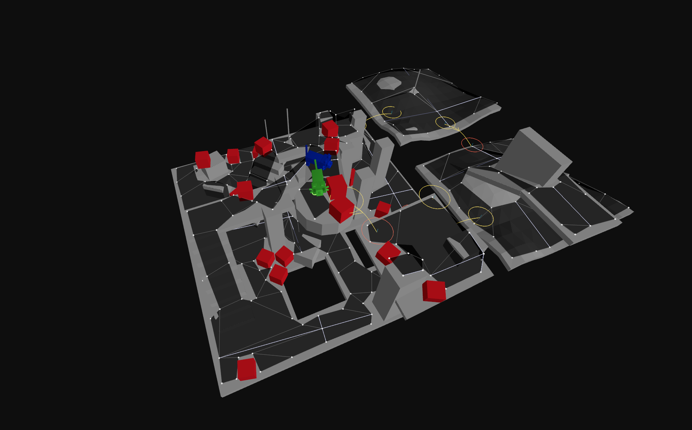

[](https://www.npmjs.com/package/navcat)

[](https://www.npmjs.com/package/navcat)


```bash
> npm install navcat
```

# navcat

navcat is a javascript navigation mesh construction and querying library for 3D floor-based navigation.

navcat is ideal for use in games, simulations, and creative websites that require pathfinding and AI navigation in complex 3D environments.

**Features**

- Navigation mesh generation from 3D geometry
- Navigation mesh querying
- Single and multi-tile navigation mesh support
- Pure javascript - no wasm
- Fully JSON serializable data structures
- Tiny - ~40 kB minified + gzipped, and highly tree-shakeable
- Works with any javascript engine/library - Babylon.js, PlayCanvas, Three.js, or your own engine

**Documentation**

This README provides curated explanations, guides, and examples to help you get started with navcat.

API documentation can be found at [navcat.dev/docs](https://navcat.dev/docs).

**Installation**

navcat is available on npm:

```bash
npm install navcat
```

**Changelog**

See the [CHANGELOG.md](./CHANGELOG.md) for a detailed list of changes in each version.

> **_NOTE:_** This library is under active development. In the leadup to a v1 release, you can expect APIs to improve and change in minor versions.

**Examples**

<table>
  <tr>
    <td align="center">
      <a href="https://navcat.dev/examples#example-crowd-simulation">
        <br/>
        Crowd Simulation
      </a>
    </td>
    <td align="center">
      <a href="https://navcat.dev/examples#example-navmesh-constrained-character-controller">
        <br/>
        Navmesh Constrained Character Controller
      </a>
    </td>
    <td align="center">
      <a href="https://navcat.dev/examples#example-custom-areas">
        <br/>
        Custom Areas
      </a>
    </td>
  </tr>
  <tr>
    <td align="center">
      <a href="https://navcat.dev/examples#example-doors-and-keys">
        <br/>
        Doors and Keys
      </a>
    </td>
    <td align="center">
      <a href="https://navcat.dev/examples#example-dynamic-obstacles">
        <br/>
        Dynamic Obstacles
      </a>
    </td>
    <td align="center">
      <a href="https://navcat.dev/examples#example-multiple-agent-sizes">
        <br/>
        Multiple Agent Sizes
      </a>
    </td>
  </tr>
  <tr>
    <td align="center">
      <a href="https://navcat.dev/examples#example-crowd-simulation-stress-test">
        <br/>
        Crowd Simulation Stress Test
      </a>
    </td>
    <td align="center">
      <a href="https://navcat.dev/examples#example-flow-field-pathfinding">
        <br/>
        Flow Field Pathfinding
      </a>
    </td>
    <td align="center">
      <a href="https://navcat.dev/examples#example-find-path">
        <br/>
        Find Path
      </a>
    </td>
  </tr>
  <tr>
    <td align="center">
      <a href="https://navcat.dev/examples#example-find-smooth-path">
        <br/>
        Find Smooth Path
      </a>
    </td>
    <td align="center">
      <a href="https://navcat.dev/examples#example-raycast">
        <br/>
        Raycast
      </a>
    </td>
    <td align="center">
      <a href="https://navcat.dev/examples#example-off-mesh-connections">
        <br/>
        Off-Mesh Connections
      </a>
    </td>
  </tr>
  <tr>
    <td align="center">
      <a href="https://navcat.dev/examples#example-upload-model">
        <br/>
        Upload Model
      </a>
    </td>
    <td align="center">
      <a href="https://navcat.dev/examples#example-custom-gltf-navmesh">
        <br/>
        Custom GLTF NavMesh
      </a>
    </td>
    <td align="center">
      <a href="https://navcat.dev/examples#example-solo-navmesh">
        <br/>
        Solo NavMesh
      </a>
    </td>
  </tr>
  <tr>
    <td align="center">
      <a href="https://navcat.dev/examples#example-tiled-navmesh">
        <br/>
        Tiled NavMesh
      </a>
    </td>
    <td align="center">
      <a href="https://navcat.dev/examples#example-flood-fill-pruning">
        <br/>
        Flood Fill Pruning
      </a>
    </td>
    <td align="center">
      <a href="https://navcat.dev/examples#example-find-nearest-poly">
        <br/>
        Find Nearest Poly
      </a>
    </td>
  </tr>
  <tr>
    <td align="center">
      <a href="https://navcat.dev/examples#example-find-random-point">
        <br/>
        Find Random Point
      </a>
    </td>
    <td align="center">
      <a href="https://navcat.dev/examples#example-find-random-point-around-circle">
        <br/>
        Find Random Point Around Circle
      </a>
    </td>
    <td align="center">
      <a href="https://navcat.dev/examples#example-mark-compact-heightfield-areas">
        <br/>
        Mark Compact Heightfield Areas
      </a>
    </td>
  </tr>
  <tr>
    <td align="center">
      <a href="https://navcat.dev/examples#example-custom-navmesh-generation">
        <br/>
        Custom NavMesh Generation
      </a>
    </td>
    <td align="center">
      <a href="https://navcat.dev/examples#example-move-along-surface">
        <br/>
        Move Along Surface
      </a>
    </td>
  </tr>
</table>


## Table of Contents

- [What is a Navigation Mesh?](#what-is-a-navigation-mesh)
- [Can navcat be integrated with my engine/library?](#can-navcat-be-integrated-with-my-enginelibrary)
- [Quick Start / Minimal Example](#quick-start-minimal-example)
- [Navigation Mesh Querying](#navigation-mesh-querying)
  - [`findPath`](#findpath)
  - [`findSmoothPath`](#findsmoothpath)
  - [`findNodePath`](#findnodepath)
  - [`findStraightPath`](#findstraightpath)
  - [`moveAlongSurface`](#movealongsurface)
  - [`raycast` & `raycastWithCosts`](#raycast-raycastwithcosts)
  - [`findNearestPoly`](#findnearestpoly)
  - [`findRandomPoint`](#findrandompoint)
  - [`findRandomPointAroundCircle`](#findrandompointaroundcircle)
- [Crowd Simulation](#crowd-simulation)
- [Navigation Mesh Generation](#navigation-mesh-generation)
  - [Overview](#overview)
    - [The Structure of a Navigation Mesh](#the-structure-of-a-navigation-mesh)
    - [Single-Tile vs Tiled Navigation Meshes](#single-tile-vs-tiled-navigation-meshes)
  - [Generation Presets](#generation-presets)
  - [Generation Process: Deep Dive](#generation-process-deep-dive)
    - [0. Input and setup](#0-input-and-setup)
    - [1. Mark walkable triangles](#1-mark-walkable-triangles)
    - [2. Rasterize triangles into a heightfield, do filtering with the heightfield](#2-rasterize-triangles-into-a-heightfield-do-filtering-with-the-heightfield)
    - [3. Build compact heightfield, erode walkable area, mark areas](#3-build-compact-heightfield-erode-walkable-area-mark-areas)
    - [4. Build compact heightfield regions](#4-build-compact-heightfield-regions)
    - [5. Build contours from compact heightfield regions](#5-build-contours-from-compact-heightfield-regions)
    - [6. Build polygon mesh from contours, build detail mesh](#6-build-polygon-mesh-from-contours-build-detail-mesh)
    - [7. Convert build-time poly mesh and poly mesh detail to runtime navmesh tile format](#7-convert-build-time-poly-mesh-and-poly-mesh-detail-to-runtime-navmesh-tile-format)
    - [8. Assemble the navigation mesh](#8-assemble-the-navigation-mesh)
  - [Post-Processing](#post-processing)
  - [Custom Query Filters and Custom Area Types](#custom-query-filters-and-custom-area-types)
  - [Off-Mesh Connections](#off-mesh-connections)
- [Advanced Navigation Mesh APIs](#advanced-navigation-mesh-apis)
  - [isValidNodeRef](#isvalidnoderef)
  - [getNodeByRef](#getnodebyref)
  - [getNodeByTileAndPoly](#getnodebytileandpoly)
  - [getPolyHeight](#getpolyheight)
  - [getClosestPointOnPoly](#getclosestpointonpoly)
  - [getClosestPointOnDetailEdges](#getclosestpointondetailedges)
  - [getPortalPoints](#getportalpoints)
  - [queryPolygons](#querypolygons)
  - [queryPolygonsInTile](#querypolygonsintile)
- [Using Externally Created Navigation Meshes](#using-externally-created-navigation-meshes)
- [Saving and Loading NavMeshes](#saving-and-loading-navmeshes)
- [Debug Utilities](#debug-utilities)
- [`navcat/three`](#navcatthree)
  - [Geometry Extraction](#geometry-extraction)
  - [Debug Helpers](#debug-helpers)
- [Community](#community)
- [Acknowledgements](#acknowledgements)

## What is a Navigation Mesh?

A navigation mesh (or navmesh) is a simplified representation of a 3D environment that is used for pathfinding and AI navigation in video games and simulations. It consists of interconnected polygons that define walkable areas within the environment. These polygons are connected by edges and off-mesh connections, allowing agents (characters) to move from one polygon to another.


## Can navcat be integrated with my engine/library?

navcat is agnostic of rendering or game engine library, so it will work well with any javascript engine - Babylon.js, PlayCanvas, Three.js, or your own engine.

If you are using threejs, you may make use of the utilities in the `navcat/three` entrypoint, see the [navcat/three docs](#navcatthree). Integrations for other engines may be added in future.

navcat adheres to the OpenGL conventions:

- Uses the right-handed coordinate system
- Indices should be in counter-clockwise winding order

If you are importing a navmesh created externally, note that navmesh poly vertices must be indexed / must share vertices between adjacent polygons.

If your environment uses a different coordinate system, you will need to transform coordinates going into and out of navcat.

The examples use threejs for rendering, but the core navcat APIs are completely agnostic of any rendering or game engine libraries.

## Quick Start / Minimal Example

Below is a minimal example of using the presets in `navcat/blocks` to generate a navigation mesh, and then using APIs in `navcat` to find a path on the generated navmesh.

For information on how to tune these options, and how the generation process works under the hood with images, see the [Navigation mesh generation](#navigation-mesh-generation) section below.

If you are using threejs, you can find [a threejs-specific version of this snippet in the navcat/three section](#navcatthree).

```ts
import { DEFAULT_QUERY_FILTER, findPath, type Vec3 } from 'navcat';
import { generateSoloNavMesh, type SoloNavMeshInput, type SoloNavMeshOptions } from 'navcat/blocks';

/* generation input */
// populate positions and indices with your level geometry
// don't include geometry that shouldn't contribute to walkable-surface
// generation, like foliage or small decorative props
const positions = new Float32Array([
    /* ... */
]);
const indices = new Uint32Array([
    /* ... */
]);

const input: SoloNavMeshInput = {
    positions,
    indices,
};

/* generation options */
// the following are defaults you might start from for a human-sized agent in a 1 m scale world.
// it's generally recommended that you use the library debug helpers to visualize the navmesh
// generation and fine tune these parameters.

// heightfield parameters
const cellSize = 0.15;
const cellHeight = 0.25;

// agent parameters
const walkableRadiusWorld = 0.3;
const walkableHeightWorld = 2.0;
const walkableClimbWorld = 0.5;
const walkableSlopeAngleDegrees = 45;

const walkableRadiusVoxels = Math.ceil(walkableRadiusWorld / cellSize);
const walkableClimbVoxels = Math.ceil(walkableClimbWorld / cellHeight);
const walkableHeightVoxels = Math.ceil(walkableHeightWorld / cellHeight);

// compact heightfield region parameters
const minRegionArea = 8;
const mergeRegionArea = 20;

// polygon generation parameters
const maxSimplificationError = 1.3;
const maxEdgeLength = 12;
const maxVerticesPerPoly = 5;

// detail mesh generation parameters
const detailSampleDistanceVoxels = 6;
const detailSampleMaxErrorVoxels = 1;

const detailSampleDistance = detailSampleDistanceVoxels < 0.9 ? 0 : cellSize * detailSampleDistanceVoxels;
const detailSampleMaxError = cellHeight * detailSampleMaxErrorVoxels;

// border size around each tile, in voxels. 0 for solo navmesh.
const borderSize = 0;

const options: SoloNavMeshOptions = {
    cellSize,
    cellHeight,
    walkableRadiusWorld,
    walkableRadiusVoxels,
    walkableClimbWorld,
    walkableClimbVoxels,
    walkableHeightWorld,
    walkableHeightVoxels,
    walkableSlopeAngleDegrees,
    borderSize,
    minRegionArea,
    mergeRegionArea,
    maxSimplificationError,
    maxEdgeLength,
    maxVerticesPerPoly,
    detailSampleDistance,
    detailSampleMaxError,
};

/* generate the navmesh */
const result = generateSoloNavMesh(input, options);

const navMesh = result.navMesh; // the nav mesh
const intermediates = result.intermediates; // intermediate data for debugging

console.log('generated navmesh:', navMesh, intermediates);

/* find a path */
const start: Vec3 = [-4, 0, -4];
const end: Vec3 = [4, 0, 4];
const halfExtents: Vec3 = [0.5, 0.5, 0.5];

const path = findPath(navMesh, start, end, halfExtents, DEFAULT_QUERY_FILTER);

console.log(
    'path:',
    path.path.map((p) => p.position),
);
```

Below is a quick summary of the navmesh generation parameters used above, and how to start tuning them:

| Parameter                   | Description                                                                                                       | Range / Heuristic for 1 = 1m humanoid agents |
| --------------------------- | ----------------------------------------------------------------------------------------------------------------- | -------------------------------------------- |
| `cellSize`                  | Horizontal voxel size (XZ). Smaller = finer detail, slower generation.                                            | ≈ `walkableRadiusWorld / 3`                  |
| `cellHeight`                | Vertical voxel size (Y). Controls height resolution.                                                              | ≈ `walkableClimbWorld / 2`                   |
| `walkableRadiusWorld`       | Agent radius (half-width). Determines clearance around walls.                                                     | 0.2–0.5 m                                    |
| `walkableHeightWorld`       | Agent height. Areas with ceilings lower than this are excluded.                                                   | 1.6–2.0 m                                    |
| `walkableSlopeAngleDegrees` | Max slope angle the agent can walk. This filters out input triangles at the very beginning of navmesh generation. | 35–50°                                       |
| `walkableClimbWorld`        | Max step height. Allows stepping up/down small edges. This filters at the heightfield navmesh generation stage.   | 0.3–0.5 m                                    |
| `minRegionArea`             | Smallest isolated region kept.                                                                                    | 4–16 voxels                                  |
| `mergeRegionArea`           | Regions smaller than this merge into neighbors.                                                                   | 8–32 voxels                                  |
| `maxSimplificationError`    | Edge simplification tolerance (higher = simpler mesh).                                                            | 1–2                                          |
| `maxEdgeLength`             | Max polygon edge length before splitting.                                                                         | 8–24                                         |
| `maxVerticesPerPoly`        | Max vertices per polygon.                                                                                         | 3–6                                          |
| `detailSampleDistance`      | Distance between height samples (affects vertical detail).                                                        | `cellSize * 4–8`, e.g. `0.9`                 |
| `detailSampleMaxError`      | Allowed height deviation when simplifying detail mesh.                                                            | `cellHeight * 1–2`, e.g. `0.25`              |


## Navigation Mesh Querying

This section covers the main features you'll use for navigation mesh querying, including pathfinding, agent simulation, and spatial queries on your navigation mesh. For lower-level querying APIs and navmesh internals, see the [Advanced Navigation Mesh APIs](#advanced-navigation-mesh-apis) section.

### `findPath`

The `findPath` function is a convenience wrapper around `findNearestPoly`, `findNodePath`, and `findStraightPath` to get a path between two points on the navigation mesh.

**When to use:** This is the simplest way to find a complete path. Use this for one-off pathfinding queries, or when you aren't steering agents along a path and re-querying frequently.

```ts
const start: Nav.Vec3 = [1, 0, 1];
const end: Nav.Vec3 = [8, 0, 8];
const halfExtents: Nav.Vec3 = [0.5, 0.5, 0.5];

// find a path from start to end
const findPathResult = Nav.findPath(navMesh, start, end, halfExtents, Nav.DEFAULT_QUERY_FILTER);

if (findPathResult.success) {
    const points = findPathResult.path.map((p) => p.position);
    console.log('path points:', points); // [ [x1, y1, z1], [x2, y2, z2], ... ]
}
```

```ts
/**
 * Find a path between two positions on a NavMesh.
 *
 * If the end node cannot be reached through the navigation graph,
 * the last node in the path will be the nearest the end node.
 *
 * Internally:
 * - finds the closest poly for the start and end positions with @see findNearestPoly
 * - finds a nav mesh node path with @see findNodePath
 * - finds a straight path with @see findStraightPath
 *
 * If you want more fine tuned behaviour you can call these methods directly.
 * For example, for agent movement you might want to find a node path once but regularly re-call @see findStraightPath
 *
 * @param navMesh The navigation mesh.
 * @param start The starting position in world space.
 * @param end The ending position in world space.
 * @param queryFilter The query filter.
 * @returns The result of the pathfinding operation.
 */
export function findPath(navMesh: NavMesh, start: Vec3, end: Vec3, halfExtents: Vec3, queryFilter: QueryFilter): FindPathResult;
```

**[`findPath` API Documentation →](https://navcat.dev/docs/functions/navcat.findPath.html)**

<table>
  <tr>
  <td align="center">
    <a href="https://navcat.dev/examples#example-find-path">
      <br/>
      <strong>Find Path</strong>
    </a>
  </td>
  </tr>
</table>

### `findSmoothPath`

Combines `findNodePath`, `findStraightPath`, and `moveAlongSurface` to produce a smooth path that respects the navmesh surface.

**When to use:** Use this when you want a smooth path that follows the navmesh surface without sharp corners, and you need it infrequently (e.g. for visual previews, not for many agents per frame).

```ts
/**
 * Find a smooth path between two positions on a NavMesh.
 *
 * This method computes a smooth path by iteratively moving along the navigation
 * mesh surface using the polygon path found between start and end positions.
 * The resulting path follows the surface more naturally than a straight path.
 *
 * If the end node cannot be reached through the navigation graph,
 * the path will go as far as possible toward the target.
 *
 * Internally:
 * - finds the closest poly for the start and end positions with @see findNearestPoly
 * - finds a nav mesh node path with @see findNodePath
 * - computes a smooth path by iteratively moving along the surface with @see moveAlongSurface
 *
 * @param navMesh The navigation mesh.
 * @param start The starting position in world space.
 * @param end The ending position in world space.
 * @param halfExtents The half extents for nearest polygon queries.
 * @param queryFilter The query filter.
 * @param stepSize The step size for movement along the surface
 * @param slop The distance tolerance for reaching waypoints
 * @returns The result of the smooth pathfinding operation, with path points containing position, type, and nodeRef information.
 */
export function findSmoothPath(navMesh: NavMesh, start: Vec3, end: Vec3, halfExtents: Vec3, queryFilter: QueryFilter, stepSize: number, slop: number, maxPoints: number): FindSmoothPathResult;
```

**[`findSmoothPath` API Documentation →](https://navcat.dev/docs/functions/navcat.findSmoothPath.html)**

<table>
  <tr>
  <td align="center">
    <a href="https://navcat.dev/examples#example-find-smooth-path">
      <br/>
      <strong>Find Smooth Path</strong>
    </a>
  </td>
  </tr>
</table>

### `findNodePath`

Finds a path through the navigation mesh as a sequence of polygon and offmesh connection node references.

**When to use:** Use this when you want to cache a node path and recalculate the straight path multiple times (e.g., for dynamic agent movement where the start position changes but the destination stays the same). This is more efficient than calling `findPath` repeatedly.

```ts
const start: Nav.Vec3 = [1, 0, 1];
const end: Nav.Vec3 = [8, 0, 8];
const halfExtents: Nav.Vec3 = [0.5, 0.5, 0.5];

// find the nearest nav mesh poly node to the start position
const startNode = Nav.findNearestPoly(
    Nav.createFindNearestPolyResult(),
    navMesh,
    start,
    halfExtents,
    Nav.DEFAULT_QUERY_FILTER,
);

// find the nearest nav mesh poly node to the end position
const endNode = Nav.findNearestPoly(Nav.createFindNearestPolyResult(), navMesh, end, halfExtents, Nav.DEFAULT_QUERY_FILTER);

// find a "node" path from start to end
if (startNode.success && endNode.success) {
    const nodePath = Nav.findNodePath(
        navMesh,
        startNode.nodeRef,
        endNode.nodeRef,
        startNode.position,
        endNode.position,
        Nav.DEFAULT_QUERY_FILTER,
    );

    console.log(nodePath.success); // true if a partial or full path was found
    console.log(nodePath.path); // [0, 1, 2, ... ]
}
```

```ts
/**
 * Find a path between two nodes.
 *
 * If the end node cannot be reached through the navigation graph,
 * the last node in the path will be the nearest the end node.
 *
 * The start and end positions are used to calculate traversal costs.
 * (The y-values impact the result.)
 *
 * @param startNodeRef The reference ID of the starting node.
 * @param endNodeRef The reference ID of the ending node.
 * @param startPosition The starting position in world space.
 * @param endPosition The ending position in world space.
 * @param filter The query filter.
 * @returns The result of the pathfinding operation.
 */
export function findNodePath(navMesh: NavMesh, startNodeRef: NodeRef, endNodeRef: NodeRef, startPosition: Vec3, endPosition: Vec3, filter: QueryFilter): FindNodePathResult;
```

**[`findNodePath` API Documentation →](https://navcat.dev/docs/functions/navcat.findNodePath.html)**

### `findStraightPath`

Performs "string pulling" to convert a sequence of nodes into a series of waypoints that form the actual path an agent should follow.

**When to use:** Call this after `findNodePath` to get the actual waypoint positions. You might recalculate this frequently while keeping the same node path, or when implementing custom path following behavior.

```ts
const start: Nav.Vec3 = [1, 0, 1];
const end: Nav.Vec3 = [8, 0, 8];

// array of nav mesh node refs, often retrieved from a call to findNodePath
const findStraightPathNodes: Nav.NodeRef[] = [
    /* ... */
];

// find the nearest nav mesh poly node to the start position
const straightPathResult = Nav.findStraightPath(navMesh, start, end, findStraightPathNodes);

console.log(straightPathResult.success); // true if a partial or full path was found
console.log(straightPathResult.path); // [ { position: [x, y, z], nodeType: NodeType, nodeRef: NodeRef }, ... ]
```

```ts
/**
 * This method peforms what is often called 'string pulling'.
 *
 * The start position is clamped to the first polygon node in the path, and the
 * end position is clamped to the last. So the start and end positions should
 * normally be within or very near the first and last polygons respectively.
 *
 * @param navMesh The navigation mesh to use for the search.
 * @param start The start position in world space.
 * @param end The end position in world space.
 * @param pathNodeRefs The list of polygon node references that form the path, generally obtained from `findNodePath`
 * @param maxPoints The maximum number of points to return in the straight path. If null, no limit is applied.
 * @param straightPathOptions @see FindStraightPathOptions
 * @returns The straight path
 */
export function findStraightPath(navMesh: NavMesh, start: Vec3, end: Vec3, pathNodeRefs: NodeRef[], maxPoints: number | null = null, straightPathOptions = 0): FindStraightPathResult;
```

**[`findStraightPath` API Documentation →](https://navcat.dev/docs/functions/navcat.findStraightPath.html)**

### `moveAlongSurface`

Moves along a navmesh from a start position toward an end position along the navmesh surface, constrained to walkable areas.

This should be called with small movement deltas (e.g., per frame) to move an agent while respecting the navmesh boundaries.

**When to use:** Perfect for simple character controllers where you want to constrain movement to the navmesh without full pathfinding. Ideal for local movement, sliding along walls, or implementing custom movement logic that respects the navmesh.

```ts
const start: Nav.Vec3 = [1, 0, 1];
const end: Nav.Vec3 = [8, 0, 8];
const halfExtents: Nav.Vec3 = [0.5, 0.5, 0.5];

const startNode = Nav.findNearestPoly(
    Nav.createFindNearestPolyResult(),
    navMesh,
    start,
    halfExtents,
    Nav.DEFAULT_QUERY_FILTER,
);

const moveAlongSurfaceResult = Nav.moveAlongSurface(navMesh, startNode.nodeRef, start, end, Nav.DEFAULT_QUERY_FILTER);

console.log(moveAlongSurfaceResult.success); // true if the move was successful
console.log(moveAlongSurfaceResult.position); // the resulting position after the move [x, y, z]
console.log(moveAlongSurfaceResult.nodeRef); // the resulting poly node ref after the move, or 0 if none
console.log(moveAlongSurfaceResult.visited); // array of node refs that were visited during the move
```

```ts
/**
 * Moves from start position towards end position along the navigation mesh surface.
 *
 * This method is optimized for small delta movement and a small number of
 * polygons. If used for too great a distance, the result set will form an
 * incomplete path.
 *
 * The resultPosition will equal the endPosition if the end is reached.
 * Otherwise the closest reachable position will be returned.
 *
 * The resulting position is projected onto the surface of the navigation mesh with @see getPolyHeight.
 *
 * @param navMesh The navigation mesh
 * @param startNodeRef The reference ID of the starting polygon
 * @param startPosition The starting position [(x, y, z)]
 * @param endPosition The ending position [(x, y, z)]
 * @param filter The query filter.
 * @returns Result containing status, final position, and visited polygons
 */
export function moveAlongSurface(navMesh: NavMesh, startNodeRef: NodeRef, startPosition: Vec3, endPosition: Vec3, filter: QueryFilter): MoveAlongSurfaceResult;
```

**[`moveAlongSurface` API Documentation →](https://navcat.dev/docs/functions/navcat.moveAlongSurface.html)**

<table>
  <tr>
  <td align="center">
    <a href="https://navcat.dev/examples#example-navmesh-constrained-character-controller">
      <br/>
      <strong>Navmesh Constrained Character Controller</strong>
    </a>
  </td>
  <td align="center">
    <a href="https://navcat.dev/examples#example-move-along-surface">
      <br/>
      <strong>Move Along Surface</strong>
    </a>
  </td>
  </tr>
</table>

### `raycast` & `raycastWithCosts`

Casts a ray along the navmesh surface to check for walkability and detect obstacles.

**When to use:** Check line-of-sight between positions, validate if a straight path exists, or detect walls/obstacles. Avoid using this for long rays; it's best suited for short-range checks given its two dimensional nature.

```ts
const start: Nav.Vec3 = [1, 0, 1];
const end: Nav.Vec3 = [8, 0, 8];
const halfExtents: Nav.Vec3 = [0.5, 0.5, 0.5];

const startNode = Nav.findNearestPoly(
    Nav.createFindNearestPolyResult(),
    navMesh,
    start,
    halfExtents,
    Nav.DEFAULT_QUERY_FILTER,
);

const raycastResult = Nav.raycast(navMesh, startNode.nodeRef, start, end, Nav.DEFAULT_QUERY_FILTER);

console.log(raycastResult.t); // the normalized distance along the ray where an obstruction was found, or 1.0 if none
console.log(raycastResult.hitNormal); // the normal of the obstruction hit, or [0, 0, 0] if none
console.log(raycastResult.hitEdgeIndex); // the index of the edge of the poly that was hit, or -1 if none
console.log(raycastResult.path); // array of node refs that were visited during the raycast
```

```ts
/**
 * Casts a 'walkability' ray along the surface of the navigation mesh from
 * the start position toward the end position.
 *
 * This method is meant to be used for quick, short distance checks.
 * The raycast ignores the y-value of the end position (2D check).
 *
 * @param navMesh The navigation mesh to use for the raycast.
 * @param startNodeRef The NodeRef for the start polygon
 * @param startPosition The starting position in world space.
 * @param endPosition The ending position in world space.
 * @param filter The query filter to apply.
 * @returns The raycast result with hit information and visited polygons (without cost calculation).
 */
export function raycast(navMesh: NavMesh, startNodeRef: NodeRef, startPosition: Vec3, endPosition: Vec3, filter: QueryFilter): RaycastResult;
```

```ts
const start: Nav.Vec3 = [1, 0, 1];
const end: Nav.Vec3 = [8, 0, 8];
const halfExtents: Nav.Vec3 = [0.5, 0.5, 0.5];

const startNode = Nav.findNearestPoly(
    Nav.createFindNearestPolyResult(),
    navMesh,
    start,
    halfExtents,
    Nav.DEFAULT_QUERY_FILTER,
);

// raycastWithCosts calculates path costs and requires the previous polygon reference
const prevRef = 0; // example
const raycastResult = Nav.raycastWithCosts(navMesh, startNode.nodeRef, start, end, Nav.DEFAULT_QUERY_FILTER, prevRef);

console.log(raycastResult.t); // the normalized distance along the ray where an obstruction was found, or 1.0 if none
console.log(raycastResult.hitNormal); // the normal of the obstruction hit, or [0, 0, 0] if none
console.log(raycastResult.hitEdgeIndex); // the index of the edge of the poly that was hit, or -1 if none
console.log(raycastResult.path); // array of node refs that were visited during the raycast
console.log(raycastResult.pathCost); // accumulated cost along the raycast path
```

```ts
/**
 * Casts a 'walkability' ray along the surface of the navigation mesh from
 * the start position toward the end position, calculating accumulated path costs.
 *
 * This method is meant to be used for quick, short distance checks.
 * The raycast ignores the y-value of the end position (2D check).
 *
 * @param navMesh The navigation mesh to use for the raycast.
 * @param startNodeRef The NodeRef for the start polygon
 * @param startPosition The starting position in world space.
 * @param endPosition The ending position in world space.
 * @param filter The query filter to apply.
 * @param prevRef The reference to the polygon we came from (for accurate cost calculations).
 * @returns The raycast result with hit information, visited polygons, and accumulated path costs.
 */
export function raycastWithCosts(navMesh: NavMesh, startNodeRef: NodeRef, startPosition: Vec3, endPosition: Vec3, filter: QueryFilter, prevRef: NodeRef): RaycastResult;
```

**[`raycast` API Documentation →](https://navcat.dev/docs/functions/navcat.raycast.html)**

**[`raycastWithCosts` API Documentation →](https://navcat.dev/docs/functions/navcat.raycastWithCosts.html)**

<table>
  <tr>
  <td align="center">
    <a href="https://navcat.dev/examples#example-raycast">
      <br/>
      <strong>Raycast</strong>
    </a>
  </td>
  </tr>
</table>

### `findNearestPoly`

Finds the nearest polygon on the navmesh to a given world position.

**When to use:** This is often your first step - use it to "snap" world positions onto the navmesh before pathfinding or querying. Essential when placing agents, checking if a position is on the navmesh, or converting world coordinates to navmesh coordinates.

```ts
const position: Nav.Vec3 = [1, 0, 1];
const halfExtents: Nav.Vec3 = [0.5, 0.5, 0.5];

// find the nearest nav mesh poly node to the position
const findNearestPolyResult = Nav.createFindNearestPolyResult();
Nav.findNearestPoly(findNearestPolyResult, navMesh, position, halfExtents, Nav.DEFAULT_QUERY_FILTER);

console.log(findNearestPolyResult.success); // true if a nearest poly was found
console.log(findNearestPolyResult.nodeRef); // the nearest poly's node ref, or 0 if none found
console.log(findNearestPolyResult.position); // the nearest point on the poly in world space [x, y, z]
```

```ts
export function findNearestPoly(result: FindNearestPolyResult, navMesh: NavMesh, center: Vec3, halfExtents: Vec3, queryFilter: QueryFilter): FindNearestPolyResult;
```

**[`findNearestPoly` API Documentation →](https://navcat.dev/docs/functions/navcat.findNearestPoly.html)**

<table>
  <tr>
  <td align="center">
    <a href="https://navcat.dev/examples#example-find-nearest-poly">
      <br/>
      <strong>Find Nearest Poly</strong>
    </a>
  </td>
  </tr>
</table>

### `findRandomPoint`

Finds a random walkable point anywhere on the navmesh.

**When to use:** Spawn points, random patrol destinations, procedural NPC placement, or testing. Great for open-world scenarios where agents need random destinations across the entire navigable area.

```ts
const randomPoint = Nav.findRandomPoint(navMesh, Nav.DEFAULT_QUERY_FILTER, Math.random);

console.log(randomPoint.success); // true if a random point was found
console.log(randomPoint.position); // [x, y, z]
console.log(randomPoint.nodeRef); // the poly node ref that the random point is on
```

```ts
/**
 * Finds a random point on the navigation mesh.
 *
 * @param navMesh The navigation mesh
 * @param filter Query filter to apply to polygons
 * @param rand Function that returns random values between [0,1]
 * @returns The result object with success flag, random point, and polygon reference
 */
export function findRandomPoint(navMesh: NavMesh, filter: QueryFilter, rand: () => number): FindRandomPointResult;
```

**[`findRandomPoint` API Documentation →](https://navcat.dev/docs/functions/navcat.findRandomPoint.html)**

<table>
  <tr>
  <td align="center">
    <a href="https://navcat.dev/examples#example-find-random-point">
      <br/>
      <strong>Find Random Point</strong>
    </a>
  </td>
  </tr>
</table>

### `findRandomPointAroundCircle`

Finds a random walkable point within a circular radius around a center position.

**When to use:** Local randomization like scatter formations, patrol areas around a point, or finding nearby positions. Perfect for "move near target" AI behaviors or creating natural-looking patrol patterns.

```ts
const center: Nav.Vec3 = [5, 0, 5];
const radius = 3.0; // world units

const halfExtents: Nav.Vec3 = [0.5, 0.5, 0.5];

const centerNode = Nav.findNearestPoly(
    Nav.createFindNearestPolyResult(),
    navMesh,
    center,
    halfExtents,
    Nav.DEFAULT_QUERY_FILTER,
);

if (centerNode.success) {
    const randomPointAroundCircle = Nav.findRandomPointAroundCircle(
        navMesh,
        centerNode.nodeRef,
        center,
        radius,
        Nav.DEFAULT_QUERY_FILTER,
        Math.random,
    );

    console.log(randomPointAroundCircle.success); // true if a random point was found
    console.log(randomPointAroundCircle.position); // [x, y, z]
    console.log(randomPointAroundCircle.nodeRef); // the poly node ref that the random point is on
}
```

```ts
/**
 * Finds a random point within a circle around a center position on the navigation mesh.
 *
 * Uses Dijkstra-like search to explore reachable polygons within the circle,
 * then selects a random polygon weighted by area, and finally generates
 * a random point within that polygon.
 *
 * @param navMesh The navigation mesh
 * @param startNodeRef Reference to the polygon to start the search from
 * @param position Center position of the search circle
 * @param maxRadius Maximum radius of the search circle
 * @param filter Query filter to apply to polygons
 * @param rand Function that returns random values [0,1]
 * @returns The result object with success flag, random point, and polygon reference
 */
export function findRandomPointAroundCircle(navMesh: NavMesh, startNodeRef: NodeRef, position: Vec3, maxRadius: number, filter: QueryFilter, rand: () => number): FindRandomPointAroundCircleResult;
```

**[`findRandomPointAroundCircle` API Documentation →](https://navcat.dev/docs/functions/navcat.findRandomPointAroundCircle.html)**

<table>
  <tr>
  <td align="center">
    <a href="https://navcat.dev/examples#example-find-random-point-around-circle">
      <br/>
      <strong>Find Random Point Around Circle</strong>
    </a>
  </td>
  </tr>
</table>

## Crowd Simulation

The `crowd` API in `navcat/blocks` provides a high-level agent simulation system built on top of navcat's pathfinding and local steering capabilities.

For simple use cases you can use it directly, and for more advanced use cases you might copy it into your project and modify it as needed.

- Agent management: add/remove agents, set target positions or velocities
- Frame-distributed pathfinding to maintain performance with many agents
- Agent-to-agent and wall avoidance
- Off-mesh connection support with animation hooks

It internally makes use of other `navcat/blocks` APIs like `pathCorridor`, `localBoundary`, and `obstacleAvoidance` to manage agent node corridors and handle obstacle avoidance.

See the docs for API specifics:
- `crowd`: https://navcat.dev/docs/modules/navcat_blocks.crowd.html
- `pathCorridor`: https://navcat.dev/docs/modules/navcat_blocks.pathCorridor.html
- `localBoundary`: https://navcat.dev/docs/modules/navcat_blocks.localBoundary.html
- `obstacleAvoidance`: https://navcat.dev/docs/modules/navcat_blocks.obstacleAvoidance.html

And see the below for interactive examples:

<table>
  <tr>
  <td align="center">
    <a href="https://navcat.dev/examples#example-crowd-simulation">
      <br/>
      <strong>Crowd Simulation</strong>
    </a>
  </td>
  <td align="center">
    <a href="https://navcat.dev/examples#example-crowd-simulation-stress-test">
      <br/>
      <strong>Crowd Simulation Stress Test</strong>
    </a>
  </td>
  </tr>
</table>

## Navigation Mesh Generation

### Overview

Navigation mesh generation is the process of transforming 3D geometry into a graph of walkable polygons. This graph is then used for pathfinding and navigation queries.

#### The Structure of a Navigation Mesh

A navigation mesh is organized into one or more **tiles**. Each tile contains walkable polygons and height detail information. For most projects, a single tile covering your entire level is perfect. For larger or dynamic worlds, you can split the navmesh into a grid of tiles.

Behind the scenes, navcat maintains a graph of **nodes** (representing polygons) and **links** (representing connections between polygons). This graph is what powers pathfinding - when you query for a path, navcat searches this graph to find the route.

If you want to dig deeper into the internal structure (useful for advanced cases like building custom pathfinding algorithms), the navigation mesh data is fully accessible. Check out the "Flow Field Pathfinding" example to see custom graph traversal in action.

#### Single-Tile vs Tiled Navigation Meshes

Most projects should start with a **single-tile navmesh** - it's simpler and covers the majority of use cases.

Consider using **tiled navmeshes** when you need:
- Dynamic updates (rebuild only affected tiles when geometry changes)
- Memory management (stream tiles in/out based on player location)
- Parallel generation (generate tiles independently)
- Large worlds (tiled navmesh generation can give better results over large areas)

For smaller, static scenes, a single-tile navmesh is simpler and sufficient.

How you want to manage tiles is up to you. You can create and add all navmesh tiles for a level at once, or you can create and add/remove tiles dynamically at runtime.

If you remove and re-add tiles at given coordinates, note that the node references for polygons will become invalidated. Any custom pathfinding logic you write that references polygons will need to call `isValidNodeRef` to check if a node reference is still valid before using it.

### Generation Presets

The `navcat/blocks` entrypoint provides `generateSoloNavMesh` and `generateTiledNavMesh` presets that bundle together the common steps of the navigation mesh generation process into easy-to-use functions.

If your use case is simple, you can use these presets to get started quickly. As your use case becomes more complex, you can eject from these presets by copying the functions (that are separate from navcat core) into your project and modifying them as needed.

You can find API docs for these blocks in the API docs:

- https://navcat.dev/docs/functions/navcat_blocks.generateSoloNavMesh.html
- https://navcat.dev/docs/functions/navcat_blocks.generateTiledNavMesh.html

See the Solo NavMesh and Tiled NavMesh examples for interactive examples of using these presets:

<table>
  <tr>
  <td align="center">
    <a href="https://navcat.dev/examples#example-solo-navmesh">
      <br/>
      <strong>Solo NavMesh</strong>
    </a>
  </td>
  <td align="center">
    <a href="https://navcat.dev/examples#example-tiled-navmesh">
      <br/>
      <strong>Tiled NavMesh</strong>
    </a>
  </td>
  </tr>
</table>

### Generation Process: Deep Dive

This section provides a deep-dive into how navigation mesh generation works. Understanding this process is useful for tuning parameters to get the best results for your specific environment and agent requirements.

The core of the navigation mesh generation approach is based on the [recastnavigation library](https://github.com/recastnavigation/recastnavigation)'s voxelization-based approach.

At a high-level:

- Input triangles are rasterized into voxels / into a heightfield
- Voxels in areas where agents (defined by your parameters) would not be able to move are filtered and removed
- Walkable areas described by the voxel grid are divided into sets of polygonal regions
- Navigation mesh polygons are created by triangulating the generated polygonal regions

Like recast, navcat supports both single and tiled navigation meshes. Single-tile meshes are suitable for many simple, static cases and are easy to work with. Tiled navmeshes are more complex to work with but better support larger, more dynamic environments, and enable advanced use cases like re-baking, navmesh data-streaming.

If you want an interactive example / starter, see the examples:

- https://navcat.dev/examples#example-generate-navmesh
- [./examples/src/example-solo-navmesh.ts](./examples/src/example-solo-navmesh.ts)
- [./blocks/generate-solo-nav-mesh.ts](./blocks/generate-solo-nav-mesh.ts)

#### 0. Input and setup

The input to the navigation mesh generation process is a set of 3D triangles that define the environment. These triangles should represent the collision surfaces in the environment, and shouldn't include any non-collidable decorative geometry that shouldn't affect navigation.

The input positions should adhere to the OpenGL conventions (right-handed coordinate system, counter-clockwise winding order).

The navigation mesh generation process emits diagnostic messages, warnings, and errors. These are captured with a build context object.

```ts
import * as Nav from 'navcat';

// flat array of vertex positions [x1, y1, z1, x2, y2, z2, ...]
const positions: number[] = [];

// flat array of triangle vertex indices
const indices: number[] = [];

// build context to capture diagnostic messages, warnings, and errors
const ctx = Nav.BuildContext.create();
```


```ts
export type BuildContextState = {
    logs: BuildContextLog[];
    times: BuildContextTime[];
    _startTimes: Record<string, number>;
};
```

#### 1. Mark walkable triangles

The first step is to filter the input triangles to find the walkable triangles. This is done by checking the slope of each triangle against a maximum walkable slope angle. Triangles that are walkable are marked with the `WALKABLE_AREA` (`1`) area type.

```ts
// CONFIG: agent walkable slope angle
const walkableSlopeAngleDegrees = 45;

// allocate an array to hold the area ids for each triangle
const triAreaIds = new Uint8Array(indices.length / 3).fill(0);

// mark triangles as walkable or not depending on their slope angle
Nav.markWalkableTriangles(positions, indices, triAreaIds, walkableSlopeAngleDegrees);
```


```ts
/**
 * Marks triangles as walkable based on their slope angle
 * @param inVertices Array of vertex coordinates [x0, y0, z0, x1, y1, z1, ...]
 * @param inIndices Array of triangle indices [i0, i1, i2, i3, i4, i5, ...]
 * @param outTriAreaIds Output array of triangle area IDs, with a length equal to inIndices.length / 3
 * @param walkableSlopeAngle Maximum walkable slope angle in degrees (default: 45)
 */
export function markWalkableTriangles(inVertices: ArrayLike<number>, inIndices: ArrayLike<number>, outTriAreaIds: ArrayLike<number>, walkableSlopeAngle = 45.0);
```

```ts
export function createTriangleAreaIdsHelper(input: {
    positions: ArrayLike<number>;
    indices: ArrayLike<number>;
}, triAreaIds: ArrayLike<number>): DebugPrimitive[];
```

#### 2. Rasterize triangles into a heightfield, do filtering with the heightfield

The walkable triangles are then voxelized into a heightfield, taking the triangle's "walkability" into each span.

Some filtering is done to the heightfield to remove spans where a character cannot stand, and unwanted overhangs are removed.

The heightfield resolution is configurable, and greatly affects the fidelity of the resulting navigation mesh, and the performance of the navigation mesh generation process.

```ts
// CONFIG: heightfield cell size and height, in world units
const cellSize = 0.2;
const cellHeight = 0.2;

// CONFIG: agent walkable climb
const walkableClimbWorld = 0.5; // in world units
const walkableClimbVoxels = Math.ceil(walkableClimbWorld / cellHeight);

// CONFIG: agent walkable height
const walkableHeightWorld = 1.0; // in world units
const walkableHeightVoxels = Math.ceil(walkableHeightWorld / cellHeight);

// calculate the bounds of the input geometry
const bounds: Nav.Box3 = [[0, 0, 0], [0, 0, 0]];
Nav.calculateMeshBounds(bounds, positions, indices);

// calculate the grid size of the heightfield
const [heightfieldWidth, heightfieldHeight] = Nav.calculateGridSize([0, 0], bounds, cellSize);

// create the heightfield
const heightfield = Nav.createHeightfield(heightfieldWidth, heightfieldHeight, bounds, cellSize, cellHeight);

// rasterize the walkable triangles into the heightfield
Nav.rasterizeTriangles(ctx, heightfield, positions, indices, triAreaIds, walkableClimbVoxels);

// filter walkable surfaces
Nav.filterLowHangingWalkableObstacles(heightfield, walkableClimbVoxels);
Nav.filterLedgeSpans(heightfield, walkableHeightVoxels, walkableClimbVoxels);
Nav.filterWalkableLowHeightSpans(heightfield, walkableHeightVoxels);
```


```ts
export type Heightfield = {
    /** the width of the heightfield (along x axis in cell units) */
    width: number;
    /** the height of the heightfield (along z axis in cell units) */
    height: number;
    /** the bounds in world space */
    bounds: Box3;
    /** the vertical size of each cell (minimum increment along y) */
    cellHeight: number;
    /** the vertical size of each cell (minimum increment along x and z) */
    cellSize: number;
    /** the heightfield of spans, (width*height) */
    spans: (HeightfieldSpan | null)[];
};
```

```ts
export type HeightfieldSpan = {
    /** the lower limit of the span */
    min: number;
    /** the upper limit of the span */
    max: number;
    /** the area id assigned to the span */
    area: number;
    /** the next heightfield span */
    next: HeightfieldSpan | null;
};
```

```ts
export function calculateMeshBounds(outBounds: Box3, inVertices: ArrayLike<number>, inIndices: ArrayLike<number>): Box3;
```

```ts
export function calculateGridSize(outGridSize: Vec2, bounds: Box3, cellSize: number): [
    width: number,
    height: number
];
```

```ts
export function createHeightfield(width: number, height: number, bounds: Box3, cellSize: number, cellHeight: number): Heightfield;
```

```ts
export function rasterizeTriangles(ctx: BuildContextState, heightfield: Heightfield, vertices: ArrayLike<number>, indices: ArrayLike<number>, triAreaIds: ArrayLike<number>, flagMergeThreshold = 1);
```

```ts
export function filterLowHangingWalkableObstacles(heightfield: Heightfield, walkableClimb: number);
```

```ts
export function filterLedgeSpans(heightfield: Heightfield, walkableHeight: number, walkableClimb: number);
```

```ts
export function filterWalkableLowHeightSpans(heightfield: Heightfield, walkableHeight: number);
```

```ts
export function createHeightfieldHelper(heightfield: Heightfield): DebugPrimitive[];
```

#### 3. Build compact heightfield, erode walkable area, mark areas

The heightfield is then compacted to only represent the top walkable surfaces.

The compact heightfield is generally eroded by the agent radius to ensure that the resulting navigation mesh is navigable by agents of the specified radius.

```ts
// build the compact heightfield
const compactHeightfield = Nav.buildCompactHeightfield(ctx, walkableHeightVoxels, walkableClimbVoxels, heightfield);

// CONFIG: agent radius
const walkableRadiusWorld = 0.6; // in world units
const walkableRadiusVoxels = Math.ceil(walkableRadiusWorld / cellSize);

// erode the walkable area by the agent radius / walkable radius
Nav.erodeWalkableArea(walkableRadiusVoxels, compactHeightfield);

// OPTIONAL: you can use utilities like markBoxArea here on the compact heightfield to mark custom areas
// see the "Custom Query Filters and Custom Area Types" section of the docs for more info
```


```ts
export type CompactHeightfield = {
    /** the width of the heightfield (along x axis in cell units) */
    width: number;
    /** the height of the heightfield (along z axis in cell units) */
    height: number;
    /** the number of spans in the heightfield */
    spanCount: number;
    /** the walkable height used during the build of the heightfield */
    walkableHeightVoxels: number;
    /** the walkable climb used during the build of the heightfield */
    walkableClimbVoxels: number;
    /** the AABB border size used during the build of the heightfield */
    borderSize: number;
    /** the maxiumum distance value of any span within the heightfield */
    maxDistance: number;
    /** the maximum region id of any span within the heightfield */
    maxRegions: number;
    /** the heightfield bounds in world space */
    bounds: Box3;
    /** the size of each cell */
    cellSize: number;
    /** the height of each cell */
    cellHeight: number;
    /** array of cells, size = width*height */
    cells: CompactHeightfieldCell[];
    /** array of spans, size = spanCount */
    spans: CompactHeightfieldSpan[];
    /** array containing area id data, size = spanCount */
    areas: number[];
    /** array containing distance field data, size = spanCount */
    distances: number[];
};
```

```ts
export type CompactHeightfieldCell = {
    /** index to the first span in the column */
    index: number;
    /** number of spans in the column */
    count: number;
};
```

```ts
export type CompactHeightfieldSpan = {
    /** the lower extent of the span. measured from the heightfields base. */
    y: number;
    /** the id of the region the span belongs to, or zero if not in a region */
    region: number;
    /** packed neighbour connection data */
    con: number;
    /** the height of the span, measured from y */
    h: number;
};
```

```ts
export function buildCompactHeightfield(ctx: BuildContextState, walkableHeightVoxels: number, walkableClimbVoxels: number, heightfield: Heightfield): CompactHeightfield;
```

```ts
export function erodeWalkableArea(walkableRadiusVoxels: number, compactHeightfield: CompactHeightfield);
```

```ts
/**
 * Erodes the walkable area for a base agent radius and marks restricted areas for larger agents based on given walkable radius thresholds.
 *
 * Note that this function requires careful tuning of the build parameters to get a good result:
 * - The cellSize needs to be small enough to accurately represent narrow passages. Generally you need to use smaller cellSizes than you otherwise would for single agent navmesh builds.
 * - The thresholds should not be so small that the resulting regions are too small to successfully build good navmesh polygons for. Values like 1-2 voxels will likely lead to poor results.
 * - You may get a better result using "buildRegionsMonotone" over "buildRegions" as this will better handle the many small clusters of areas that may be created from smaller thresholds.
 *
 * A typical workflow for using this utility to implement multi-agent support:
 * 1. Call erodeAndMarkWalkableAreas with your smallest agent radius and list of restricted areas
 * 2. Continue with buildDistanceField, buildRegionsMonotone, etc.
 * 3. Configure query filters so large agents exclude the narrow/restricted area IDs
 *
 * @param baseWalkableRadiusVoxels the smallest agent radius in voxels (used for erosion)
 * @param thresholds array of area ids and their corresponding walkable radius in voxels.
 * @param compactHeightfield the compact heightfield to process
 */
export function erodeAndMarkWalkableAreas(baseWalkableRadiusVoxels: number, thresholds: Array<{
    areaId: number;
    walkableRadiusVoxels: number;
}>, compactHeightfield: CompactHeightfield);
```

```ts
export function createCompactHeightfieldSolidHelper(compactHeightfield: CompactHeightfield): DebugPrimitive[];
```

#### 4. Build compact heightfield regions

The compact heightfield is then analyzed to identify distinct walkable regions. These regions are used to create the final navigation mesh.

Some of the region generation algorithms compute a distance field to identify regions.

```ts
// prepare for region partitioning by calculating a distance field along the walkable surface
Nav.buildDistanceField(compactHeightfield);

// CONFIG: borderSize, relevant if you are building a tiled navmesh
const borderSize = 0;

// CONFIG: minRegionArea
const minRegionArea = 8; // voxel units

// CONFIG: mergeRegionArea
const mergeRegionArea = 20; // voxel units

// partition the walkable surface into simple regions without holes
Nav.buildRegions(ctx, compactHeightfield, borderSize, minRegionArea, mergeRegionArea);
```


```ts
export function buildDistanceField(compactHeightfield: CompactHeightfield): void;
```

```ts
export function buildRegions(ctx: BuildContextState, compactHeightfield: CompactHeightfield, borderSize: number, minRegionArea: number, mergeRegionArea: number): boolean;
```

```ts
/**
 * Build regions using monotone partitioning algorithm.
 * This is an alternative to the watershed-based buildRegions function.
 * Monotone partitioning creates regions by sweeping the heightfield and
 * does not generate overlapping regions.
 */
export function buildRegionsMonotone(compactHeightfield: CompactHeightfield, borderSize: number, minRegionArea: number, mergeRegionArea: number): boolean;
```

```ts
/**
 * Build layer regions using sweep-line algorithm.
 * This creates regions that can be used for building navigation mesh layers.
 * Layer regions handle overlapping walkable areas by creating separate layers.
 */
export function buildLayerRegions(compactHeightfield: CompactHeightfield, borderSize: number, minRegionArea: number): boolean;
```

```ts
export function createCompactHeightfieldDistancesHelper(compactHeightfield: CompactHeightfield): DebugPrimitive[];
```

```ts
export function createCompactHeightfieldRegionsHelper(compactHeightfield: CompactHeightfield): DebugPrimitive[];
```

#### 5. Build contours from compact heightfield regions

Contours are generated around the edges of the regions. These contours are simplified to reduce the number of vertices while maintaining the overall shape.

```ts
// CONFIG: maxSimplificationError
const maxSimplificationError = 1.3; // voxel units

// CONFIG: maxEdgeLength
const maxEdgeLength = 6.0; // voxel units

// trace and simplify region contours
const contourSet = Nav.buildContours(
    ctx,
    compactHeightfield,
    maxSimplificationError,
    maxEdgeLength,
    Nav.ContourBuildFlags.CONTOUR_TESS_WALL_EDGES,
);
```


```ts
export type ContourSet = {
    /** an array of the contours in the set */
    contours: Contour[];
    /** the bounds in world space */
    bounds: Box3;
    /** the size of each cell */
    cellSize: number;
    /** the height of each cell */
    cellHeight: number;
    /** the width of the set */
    width: number;
    /** the height of the set */
    height: number;
    /**the aabb border size used to generate the source data that the contour set was derived from */
    borderSize: number;
    /** the max edge error that this contour set was simplified with */
    maxError: number;
};
```

```ts
export type Contour = {
    /** simplified contour vertex and connection data. size: 4 * nVerts */
    vertices: number[];
    /** the number of vertices in the simplified contour */
    nVertices: number;
    /** raw contour vertex and connection data */
    rawVertices: number[];
    /** the number of vertices in the raw contour */
    nRawVertices: number;
    /** the region id of the contour */
    reg: number;
    /** the area id of the contour */
    area: number;
};
```

```ts
export function buildContours(ctx: BuildContextState, compactHeightfield: CompactHeightfield, maxSimplificationError: number, maxEdgeLength: number, buildFlags: ContourBuildFlags): ContourSet;
```

```ts
export function createRawContoursHelper(contourSet: ContourSet): DebugPrimitive[];
```

```ts
export function createSimplifiedContoursHelper(contourSet: ContourSet): DebugPrimitive[];
```

#### 6. Build polygon mesh from contours, build detail mesh

From the simplified contours, a polygon mesh is created. This mesh consists of convex polygons that represent the walkable areas.

A "detail triangle mesh" is also generated to capture more accurate height information for each polygon.

```ts
// CONFIG: max vertices per polygon
const maxVerticesPerPoly = 5; // 3-6, higher = less polys, but more complex polys

const polyMesh = Nav.buildPolyMesh(ctx, contourSet, maxVerticesPerPoly);

for (let polyIndex = 0; polyIndex < polyMesh.nPolys; polyIndex++) {
    // make all "areas" use a base area id of 0
    if (polyMesh.areas[polyIndex] === Nav.WALKABLE_AREA) {
        polyMesh.areas[polyIndex] = 0;
    }

    // give all base "walkable" polys all flags
    if (polyMesh.areas[polyIndex] === 0) {
        polyMesh.flags[polyIndex] = 1;
    }
}

// CONFIG: detail mesh sample distance
const sampleDist = 1.0; // world units

// CONFIG: detail mesh max sample error
const sampleMaxError = 1.0; // world units

const polyMeshDetail = Nav.buildPolyMeshDetail(ctx, polyMesh, compactHeightfield, sampleDist, sampleMaxError);
```


```ts
/**
 * Represents a polygon mesh suitable for use in building a navigation mesh.
 */
export type PolyMesh = {
    /** The mesh vertices. Form: (x, y, z) * nverts */
    vertices: number[];
    /** Polygon vertex indices. Length: npolys * nvp */
    polys: number[];
    /** The region id assigned to each polygon. Length: npolys */
    regions: number[];
    /** The user defined flags for each polygon. Length: npolys */
    flags: number[];
    /** The area id assigned to each polygon. Length: npolys */
    areas: number[];
    /** The number of vertices */
    nVertices: number;
    /** The number of polygons */
    nPolys: number;
    /** The maximum number of vertices per polygon */
    maxVerticesPerPoly: number;
    /** the bounds in world space */
    bounds: Box3;
    /** the width in local space */
    localWidth: number;
    /** the height in local space */
    localHeight: number;
    /** The size of each cell. (On the xz-plane.) */
    cellSize: number;
    /** The height of each cell. (The minimum increment along the y-axis.) */
    cellHeight: number;
    /** The AABB border size used to generate the source data from which the mesh was derived */
    borderSize: number;
    /** The max error of the polygon edges in the mesh */
    maxEdgeError: number;
};
```

```ts
/**
 * Contains triangle meshes that represent detailed height data associated
 * with the polygons in its associated polygon mesh object.
 */
export type PolyMeshDetail = {
    /** The sub-mesh data. Size: 4*nMeshes. Layout: [verticesBase1, trianglesBase1, verticesCount1, trianglesCount1, ...] */
    meshes: number[];
    /** The mesh vertices. Size: 3*nVertices */
    vertices: number[];
    /** The mesh triangles. Size: 4*nTriangles */
    triangles: number[];
    /** The number of sub-meshes defined by meshes */
    nMeshes: number;
    /** The number of vertices in verts */
    nVertices: number;
    /** The number of triangles in tris */
    nTriangles: number;
};
```

```ts
export function buildPolyMesh(ctx: BuildContextState, contourSet: ContourSet, maxVerticesPerPoly: number): PolyMesh;
```

```ts
export function buildPolyMeshDetail(ctx: BuildContextState, polyMesh: PolyMesh, compactHeightfield: CompactHeightfield, sampleDist: number, sampleMaxError: number): PolyMeshDetail;
```

```ts
export function createPolyMeshHelper(polyMesh: PolyMesh): DebugPrimitive[];
```

#### 7. Convert build-time poly mesh and poly mesh detail to runtime navmesh tile format

Next, we do a post-processing step on the poly mesh and the poly mesh detail to prepare them for use in the navigation mesh.

This step involes computing adjacency information for the polygons, and mapping the generation-time format to the runtime navigation mesh tile format.

```ts
// convert the poly mesh to a navmesh tile polys
const tilePolys = Nav.polyMeshToTilePolys(polyMesh);

// convert the poly mesh detail to a navmesh tile detail mesh
const tileDetailMesh = Nav.polyMeshDetailToTileDetailMesh(tilePolys.polys, polyMeshDetail);
```

```ts
export function polyMeshToTilePolys(polyMesh: PolyMesh): NavMeshTilePolys;
```

```ts
export type NavMeshPoly = {
    /** The indices of the polygon's vertices. vertices are stored in NavMeshTile.vertices */
    vertices: number[];

    /**
     * Packed data representing neighbor polygons references and flags for each edge.
     * This is usually computed by the navcat's `buildPolyNeighbours` function .
     */
    neis: number[];

    /** The user defined flags for this polygon */
    flags: number;

    /** The user defined area id for this polygon */
    area: number;
};
```

```ts
/**
 * Converts a given PolyMeshDetail to the tile detail mesh format.
 * @param polys
 * @param polyMeshDetail
 * @returns
 */
export function polyMeshDetailToTileDetailMesh(polys: NavMeshPoly[], polyMeshDetail: PolyMeshDetail);
```

```ts
export type NavMeshPolyDetail = {
    /**
     * The offset of the vertices in the NavMeshTile detailVertices array.
     * If the base index is between 0 and `NavMeshTile.vertices.length`, this is used to index into the NavMeshTile vertices array.
     * If the base index is greater than `NavMeshTile.vertices.length`, it is used to index into the NavMeshTile detailVertices array.
     * This allows for detail meshes to either re-use the polygon vertices or to define their own vertices without duplicating data.
     */
    verticesBase: number;

    /** The offset of the triangles in the NavMeshTile detailTriangles array */
    trianglesBase: number;

    /** The number of vertices in thde sub-mesh */
    verticesCount: number;

    /** The number of triangles in the sub-mesh */
    trianglesCount: number;
};
```

```ts
export function createPolyMeshDetailHelper(polyMeshDetail: PolyMeshDetail): DebugPrimitive[];
```

#### 8. Assemble the navigation mesh

Finally, the polygon mesh and detail mesh are combined to create a navigation mesh tile. This tile can be used for pathfinding and navigation queries.

```ts
// create the navigation mesh
const navMesh = Nav.createNavMesh();

// set the navmesh parameters using the poly mesh bounds
// this example is for a single tile navmesh, so the tile width/height is the same as the poly mesh bounds size
navMesh.tileWidth = polyMesh.bounds[1][0] - polyMesh.bounds[0][0];
navMesh.tileHeight = polyMesh.bounds[1][2] - polyMesh.bounds[0][2];
navMesh.origin[0] = polyMesh.bounds[0][0];
navMesh.origin[1] = polyMesh.bounds[0][1];
navMesh.origin[2] = polyMesh.bounds[0][2];

// assemble the navmesh tile params
const tileParams: Nav.NavMeshTileParams = {
    bounds: polyMesh.bounds,
    vertices: tilePolys.vertices,
    polys: tilePolys.polys,
    detailMeshes: tileDetailMesh.detailMeshes,
    detailVertices: tileDetailMesh.detailVertices,
    detailTriangles: tileDetailMesh.detailTriangles,
    tileX: 0,
    tileY: 0,
    tileLayer: 0,
    cellSize,
    cellHeight,
    walkableHeight: walkableHeightWorld,
    walkableRadius: walkableRadiusWorld,
    walkableClimb: walkableClimbWorld,
};

// build the nav mesh tile - this creates a BV tree, and initialises runtime tile properties
const tile = Nav.buildTile(tileParams);

// add the tile to the navmesh
Nav.addTile(navMesh, tile);
```


```ts
/**
 * Creates a new empty navigation mesh.
 * @returns The created navigation mesh
 */
export function createNavMesh(): NavMesh;
```

```ts
/**
 * Builds a navmesh tile from the given parameters
 * This builds a BV-tree for the tile, and initializes runtime tile properties
 * @param params the parameters to build the tile from
 * @returns the built navmesh tile
 */
export function buildTile(params: NavMeshTileParams): NavMeshTile;
```

```ts
/**
 * Adds a tile to the navmesh.
 * If a tile already exists at the same position, it will be removed first.
 * @param navMesh the navmesh to add the tile to
 * @param tile the tile to add
 */
export function addTile(navMesh: NavMesh, tile: NavMeshTile): void;
```

```ts
/**
 * Removes the tile at the given location
 * @param navMesh the navmesh to remove the tile from
 * @param x the x coordinate of the tile
 * @param y the y coordinate of the tile
 * @param layer the layer of the tile
 * @returns true if the tile was removed, otherwise false
 */
export function removeTile(navMesh: NavMesh, x: number, y: number, layer: number): boolean;
```

```ts
export function createNavMeshHelper(navMesh: NavMesh): DebugPrimitive[];
```

### Post-Processing

A common post-processing step after generating a navigation mesh is to flood-fill the navmesh from given "seed points" that represent valid starting locations, to exclude any isolated or unreachable areas. This is useful when generating navmeshes for complex environments where some inside of walls or on top of ceilings may be marked as walkable by the generation process, but are not actually reachable by agents for your use case.

The `navcat/blocks` entrypoint provides a `floodFillNavMesh` utility that helps with this process.

You can see the "Flood Fill Pruning" example to see how to use this utility:

```ts
export function floodFillNavMesh(navMesh: NavMesh, startNodeRefs: NodeRef[]): {
    reachable: NodeRef[];
    unreachable: NodeRef[];
};
```

<table>
  <tr>
  <td align="center">
    <a href="https://navcat.dev/examples#example-flood-fill-pruning">
      <br/>
      <strong>Flood Fill Pruning</strong>
    </a>
  </td>
  </tr>
</table>

### Custom Query Filters and Custom Area Types

Most navigation mesh querying APIs accept a `queryFilter` parameter that allows you to customize how the query is performed.

You can provide a cost calculation function to modify the cost of traversing polygons, and you can provide a filter function to include/exclude polygons based on their area and flags.

```ts
export type QueryFilter = {
    /**
     * Checks if a NavMesh node passes the filter.
     * @param nodeRef The node reference.
     * @param navMesh The navmesh
     * @returns Whether the node reference passes the filter.
     */
    passFilter(nodeRef: NodeRef, navMesh: NavMesh): boolean;

    /**
     * Calculates the cost of moving from one point to another.
     * @param pa The start position on the edge of the previous and current node. [(x, y, z)]
     * @param pb The end position on the edge of the current and next node. [(x, y, z)]
     * @param navMesh The navigation mesh
     * @param prevRef The reference id of the previous node. [opt]
     * @param curRef The reference id of the current node.
     * @param nextRef The reference id of the next node. [opt]
     * @returns The cost of moving from the start to the end position.
     */
    getCost(
        pa: Vec3,
        pb: Vec3,
        navMesh: NavMesh,
        prevRef: NodeRef | undefined,
        curRef: NodeRef,
        nextRef: NodeRef | undefined,
    ): number;
};
```

```ts
export const DEFAULT_QUERY_FILTER = {
    includeFlags: 0xffffffff,
    excludeFlags: 0,
    getCost(pa, pb, _navMesh, _prevRef, _curRef, _nextRef) {
        // use the distance between the two points as the cost
        return vec3.distance(pa, pb);
    },
    passFilter(nodeRef, navMesh) {
        // check whether the node's flags pass 'includeFlags' and 'excludeFlags' checks
        const { flags } = getNodeByRef(navMesh, nodeRef);

        return (flags & this.includeFlags) !== 0 && (flags & this.excludeFlags) === 0;
    },
} satisfies DefaultQueryFilter;
```

Many simple use cases can get far with using the default query `Nav.DEFAULT_QUERY_FILTER`. If you want to customise cost calculations, or include/exclude areas based on areas and flags, you can provide your own query filter that implements the `QueryFilter` type interface.

You can reference the "Custom Areas" example to see how to mark areas with different types and use a custom query filter:

<table>
  <tr>
  <td align="center">
    <a href="https://navcat.dev/examples#example-custom-areas">
      <br/>
      <strong>Custom Areas</strong>
    </a>
  </td>
  <td align="center">
    <a href="https://navcat.dev/examples#example-multiple-agent-sizes">
      <br/>
      <strong>Multiple Agent Sizes</strong>
    </a>
  </td>
  </tr>
</table>

### Off-Mesh Connections

Off-mesh connections enable navigation between non-adjacent areas by representing special traversal actions like jumping gaps, climbing ladders, teleporting, or opening doors.

**When to use:** Add off-mesh connections when your environment has gaps, vertical transitions, or special traversal mechanics that can't be represented by the standard navmesh polygons. The pathfinding system will automatically consider these connections when finding paths.

```ts
// define a bidirectional off-mesh connection between two points
const bidirectionalOffMeshConnection: Nav.OffMeshConnectionParams = {
    // start position in world space
    start: [0, 0, 0],
    // end position in world space
    end: [1, 0, 1],
    // radius of the connection endpoints, if it's too small a poly may not be found to link the connection to
    radius: 0.5,
    // the direction of the off-mesh connection (START_TO_END or BIDIRECTIONAL)
    direction: Nav.OffMeshConnectionDirection.BIDIRECTIONAL,
    // flags for the off-mesh connection, you can use this for custom behaviour with query filters
    flags: 1,
    // area id for the off-mesh connection, you can use this for custom behaviour with query filters
    area: 0,
};

// add the off-mesh connection to the nav mesh, returns the off-mesh connection id
const bidirectionalOffMeshConnectionId = Nav.addOffMeshConnection(navMesh, bidirectionalOffMeshConnection);

// true if the off-mesh connection is linked to polys, false if a suitable poly couldn't be found
Nav.isOffMeshConnectionConnected(navMesh, bidirectionalOffMeshConnectionId);

// retrieve the off-mesh connection attachment info, which contains the start and end poly node refs that the connection is linked to
const offMeshConnectionAttachment = navMesh.offMeshConnectionAttachments[bidirectionalOffMeshConnectionId];

if (offMeshConnectionAttachment) {
    console.log(offMeshConnectionAttachment.startPolyNode); // the start poly node ref that the off-mesh connection is linked to
    console.log(offMeshConnectionAttachment.endPolyNode); // the end poly node ref that the off-mesh connection is linked to
}

// remove the off-mesh connection from the nav mesh
Nav.removeOffMeshConnection(navMesh, bidirectionalOffMeshConnectionId);

// define a one-way off-mesh connection (e.g. a teleporter that only goes one way)
const oneWayTeleporterOffMeshConnection: Nav.OffMeshConnectionParams = {
    start: [2, 0, 2],
    end: [3, 1, 3],
    radius: 0.5,
    direction: Nav.OffMeshConnectionDirection.START_TO_END,
    flags: 1,
    area: 0,
};

// add the off-mesh connection to the nav mesh, returns the off-mesh connection id
const oneWayTeleporterOffMeshConnectionId = Nav.addOffMeshConnection(navMesh, oneWayTeleporterOffMeshConnection);

// remove the off-mesh connection from the nav mesh
Nav.removeOffMeshConnection(navMesh, oneWayTeleporterOffMeshConnectionId);
```

To see a live example, see the "Off-Mesh Connections Example":

<table>
  <tr>
  <td align="center">
    <a href="https://navcat.dev/examples#example-off-mesh-connections">
      <br/>
      <strong>Off-Mesh Connections</strong>
    </a>
  </td>
  </tr>
</table>

```ts
/**
 * Adds a new off mesh connection to the NavMesh, and returns it's ID
 * @param navMesh the navmesh to add the off mesh connection to
 * @param offMeshConnectionParams the parameters of the off mesh connection to add
 * @returns the ID of the added off mesh connection
 */
export function addOffMeshConnection(navMesh: NavMesh, offMeshConnectionParams: OffMeshConnectionParams): number;
```

```ts
/**
 * Removes an off mesh connection from the NavMesh
 * @param navMesh the navmesh to remove the off mesh connection from
 * @param offMeshConnectionId the ID of the off mesh connection to remove
 */
export function removeOffMeshConnection(navMesh: NavMesh, offMeshConnectionId: number): void;
```

```ts
export function isOffMeshConnectionConnected(navMesh: NavMesh, offMeshConnectionId: number): boolean;
```

## Advanced Navigation Mesh APIs

This section covers lower-level APIs for working with the navigation mesh structure. Most users won't need these for everyday pathfinding, but they're useful for advanced use cases like understanding the navmesh internals, building custom pathfinding algorithms, or debugging.

### isValidNodeRef

```ts
const nodeRef: Nav.NodeRef = 0;

// true if the node ref is valid, useful to call after updating tiles to validate the reference is still valid
const isValid = Nav.isValidNodeRef(navMesh, nodeRef);
console.log(isValid);
```

```ts
/**
 * Checks if a navigation mesh node reference is valid.
 * @param navMesh the navigation mesh
 * @param nodeRef the node reference
 * @returns true if the node reference is valid, false otherwise
 */
export function isValidNodeRef(navMesh: NavMesh, nodeRef: NodeRef): boolean;
```

### getNodeByRef

```ts
const node = Nav.getNodeByRef(navMesh, nodeRef);
console.log(node);
```

```ts
/**
 * Gets a navigation mesh node by its reference.
 * Note that navmesh nodes are pooled and may be reused on removing then adding tiles, so do not store node objects.
 * @param navMesh the navigation mesh
 * @param nodeRef the node reference
 * @returns the navigation mesh node
 */
export function getNodeByRef(navMesh: NavMesh, nodeRef: NodeRef);
```

### getNodeByTileAndPoly

```ts
const node = Nav.getNodeByTileAndPoly(navMesh, tile, polyIndex);
console.log(node);
```

```ts
/**
 * Gets a navigation mesh node by its tile and polygon index.
 * @param navMesh the navigation mesh
 * @param tile the navigation mesh tile
 * @param polyIndex the polygon index
 * @returns the navigation mesh node
 */
export function getNodeByTileAndPoly(navMesh: NavMesh, tile: NavMeshTile, polyIndex: number);
```

### getPolyHeight

```ts
const position: Nav.Vec3 = [1, 0, 1];
const halfExtents: Nav.Vec3 = [0.5, 0.5, 0.5];

const nearestPoly = Nav.findNearestPoly(
    Nav.createFindNearestPolyResult(),
    navMesh,
    position,
    halfExtents,
    Nav.DEFAULT_QUERY_FILTER,
);

const tileAndPoly = Nav.getTileAndPolyByRef(nearestPoly.nodeRef, navMesh);

if (nearestPoly.success) {
    const getPolyHeightResult = Nav.createGetPolyHeightResult();
    Nav.getPolyHeight(getPolyHeightResult, tileAndPoly.tile!, tileAndPoly.poly!, tileAndPoly.polyIndex, position);

    console.log(getPolyHeightResult.success); // true if a height was found
    console.log(getPolyHeightResult.height); // the height of the poly at the position
}
```

```ts
/**
 * Gets the height of a polygon at a given point using detail mesh if available.
 * @param result The result object to populate
 * @param tile The tile containing the polygon
 * @param poly The polygon
 * @param polyIndex The index of the polygon in the tile
 * @param pos The position to get height for
 * @returns The result object with success flag and height
 */
export function getPolyHeight(result: GetPolyHeightResult, tile: NavMeshTile, poly: NavMeshPoly, polyIndex: number, pos: Vec3): GetPolyHeightResult;
```

### getClosestPointOnPoly

```ts
const polyRef = findNearestPolyResult.nodeRef;
const getClosestPointOnPolyResult = Nav.createGetClosestPointOnPolyResult();

Nav.getClosestPointOnPoly(getClosestPointOnPolyResult, navMesh, polyRef, position);

console.log(getClosestPointOnPolyResult.success); // true if a closest point was found
console.log(getClosestPointOnPolyResult.isOverPoly); // true if the position was inside the poly
console.log(getClosestPointOnPolyResult.position); // the closest point on the poly in world space [x, y, z]
```

```ts
/**
 * Gets the closest point on a polygon to a given point
 * @param result the result object to populate
 * @param navMesh the navigation mesh
 * @param nodeRef the polygon node reference
 * @param position the point to find the closest point to
 * @returns the result object
 */
export function getClosestPointOnPoly(result: GetClosestPointOnPolyResult, navMesh: NavMesh, nodeRef: NodeRef, position: Vec3): GetClosestPointOnPolyResult;
```

### getClosestPointOnDetailEdges

```ts
const position: Nav.Vec3 = [1, 0, 1];
const halfExtents: Nav.Vec3 = [0.5, 0.5, 0.5];

// find the nearest nav mesh poly node to the position
const nearestPoly = Nav.findNearestPoly(
    Nav.createFindNearestPolyResult(),
    navMesh,
    position,
    halfExtents,
    Nav.DEFAULT_QUERY_FILTER,
);

const tileAndPoly = Nav.getTileAndPolyByRef(nearestPoly.nodeRef, navMesh);

const closestPoint: Nav.Vec3 = [0, 0, 0];
const onlyBoundaryEdges = false;

const squaredDistance = Nav.getClosestPointOnDetailEdges(
    closestPoint,
    tileAndPoly.tile!,
    tileAndPoly.poly!,
    tileAndPoly.polyIndex,
    position,
    onlyBoundaryEdges,
);

console.log(squaredDistance); // squared distance from position to closest point
console.log(closestPoint); // the closest point on the detail edges in world space [x, y, z]
```

```ts
/**
 * Gets the closest point on detail mesh edges to a given point
 * @param tile The tile containing the detail mesh
 * @param poly The polygon
 * @param pos The position to find closest point for
 * @param outClosestPoint Output parameter for the closest point
 * @param onlyBoundary If true, only consider boundary edges
 * @returns The squared distance to the closest point
 *  closest point
 */
export function getClosestPointOnDetailEdges(outClosestPoint: Vec3, tile: NavMeshTile, poly: NavMeshPoly, polyIndex: number, pos: Vec3, onlyBoundary: boolean): number;
```

### getPortalPoints

```ts
const startNodeRef: Nav.NodeRef = 0; // example poly node ref, usually retrieved from a pathfinding call
const endNodeRef: Nav.NodeRef = 0; // example poly node ref, usually retrieved from a pathfinding call

const left: Nav.Vec3 = [0, 0, 0];
const right: Nav.Vec3 = [0, 0, 0];

const getPortalPointsSuccess = Nav.getPortalPoints(navMesh, startNodeRef, endNodeRef, left, right);

console.log(getPortalPointsSuccess); // true if the portal points were found
console.log('left:', left);
console.log('right:', right);
```

```ts
/**
 * Retrieves the left and right points of the portal edge between two adjacent polygons.
 * Or if one of the polygons is an off-mesh connection, returns the connection endpoint for both left and right.
 */
export function getPortalPoints(navMesh: NavMesh, fromNodeRef: NodeRef, toNodeRef: NodeRef, outLeft: Vec3, outRight: Vec3): boolean;
```

### queryPolygons

```ts
// find all polys within a box area
const bounds: Nav.Box3 = [
    [0, 0, 0],
    [1, 1, 1],
];

const queryPolygonsResult = Nav.queryPolygons(navMesh, bounds, Nav.DEFAULT_QUERY_FILTER);

console.log(queryPolygonsResult); // array of node refs that overlap the box area
```

```ts
export function queryPolygons(navMesh: NavMesh, bounds: Box3, filter: QueryFilter): NodeRef[];
```

### queryPolygonsInTile

```ts
const tile = Object.values(navMesh.tiles)[0]; // example tile
const bounds: Nav.Box3 = tile.bounds;

const outNodeRefs: Nav.NodeRef[] = [];

Nav.queryPolygonsInTile(outNodeRefs, navMesh, tile, bounds, Nav.DEFAULT_QUERY_FILTER);
```

```ts
export function queryPolygonsInTile(out: NodeRef[], navMesh: NavMesh, tile: NavMeshTile, bounds: Box3, filter: QueryFilter): void;
```

## Using Externally Created Navigation Meshes

Although this library provides a robust method of generating navigation meshes from 3D geometry, you can also bring your own navigation meshes if you author them manually, or generate them with another tool.

You can pass any external polygon data to the `polygonsToNavMeshTilePolys` utility to convert it into the navcat runtime navigation mesh tile format.

You can also use `polysToTileDetailMesh` to generate a detail mesh for your polygons, or you can provide your own detail triangle mesh if you have height data for your polygons.

See the "Custom GLTF NavMesh" Example to see how to use an "externally generated" navigation mesh with navcat:

<table>
  <tr>
  <td align="center">
    <a href="https://navcat.dev/examples#example-custom-gltf-navmesh">
      <br/>
      <strong>Custom GLTF NavMesh</strong>
    </a>
  </td>
  </tr>
</table>

## Saving and Loading NavMeshes

Because the navigation mesh is a normal JSON-serializable object, you can easily save and load navigation meshes to/from disk, or send them over a network. It is as simple as `JSON.stringify(navMesh)` and `JSON.parse(navMeshJsonString)`, really.

## Debug Utilities

navcat provides graphics-library agnostic debug drawing functions to help visualize the navmesh and related data structures.

If you are using threejs, you can use the `navcat/three` entrypoint's debug helpers to create threejs objects for visualization, see the [navcat/three section](#navcatthree) below.

If you are using a different library, you write your own functions to visualize the debug primitives below.

```ts
const triangleAreaIdsHelper = Nav.createTriangleAreaIdsHelper({ positions, indices }, triAreaIds);

const heightfieldHelper = Nav.createHeightfieldHelper(heightfield);

const compactHeightfieldSolidHelper = Nav.createCompactHeightfieldSolidHelper(compactHeightfield);

const compactHeightfieldDistancesHelper = Nav.createCompactHeightfieldDistancesHelper(compactHeightfield);

const compactHeightfieldRegionsHelper = Nav.createCompactHeightfieldRegionsHelper(compactHeightfield);

const rawContoursHelper = Nav.createRawContoursHelper(contourSet);

const simplifiedContoursHelper = Nav.createSimplifiedContoursHelper(contourSet);

const polyMeshHelper = Nav.createPolyMeshHelper(polyMesh);

const polyMeshDetailHelper = Nav.createPolyMeshDetailHelper(polyMeshDetail);

const navMeshHelper = Nav.createNavMeshHelper(navMesh);

const navMeshTileHelper = Nav.createNavMeshTileHelper(Object.values(navMesh.tiles)[0]);

const navMeshPolyHelper = Nav.createNavMeshPolyHelper(navMesh, 0);

const navMeshTileBvTreeHelper = Nav.createNavMeshTileBvTreeHelper(tile);

const navMeshBvTreeHelper = Nav.createNavMeshBvTreeHelper(navMesh);

const navMeshLinksHelper = Nav.createNavMeshLinksHelper(navMesh);

const navMeshTilePortalsHelper = Nav.createNavMeshTilePortalsHelper(tile);

const navMeshPortalsHelper = Nav.createNavMeshPortalsHelper(navMesh);

const findNodePathResult = Nav.findNodePath(navMesh, 0, 0, [1, 0, 1], [8, 0, 8], Nav.DEFAULT_QUERY_FILTER);
const searchNodesHelper = Nav.createSearchNodesHelper(findNodePathResult.nodes);

const navMeshOffMeshConnectionsHelper = Nav.createNavMeshOffMeshConnectionsHelper(navMesh);
```

```ts
export type DebugPrimitive = DebugTriangles | DebugLines | DebugPoints | DebugBoxes;
```

```ts
export type DebugTriangles = {
    type: DebugPrimitiveType.Triangles;
    positions: number[]; // x,y,z for each vertex
    colors: number[]; // r,g,b for each vertex
    indices: number[]; // triangle indices
    transparent?: boolean;
    opacity?: number;
    doubleSided?: boolean;
};
```

```ts
export type DebugLines = {
    type: DebugPrimitiveType.Lines;
    positions: number[]; // x,y,z for each line endpoint
    colors: number[]; // r,g,b for each line endpoint
    lineWidth?: number;
    transparent?: boolean;
    opacity?: number;
};
```

```ts
export type DebugPoints = {
    type: DebugPrimitiveType.Points;
    positions: number[]; // x,y,z for each point
    colors: number[]; // r,g,b for each point
    size: number;
    transparent?: boolean;
    opacity?: number;
};
```

```ts
export type DebugBoxes = {
    type: DebugPrimitiveType.Boxes;
    positions: number[]; // x,y,z center for each box
    colors: number[]; // r,g,b for each box
    scales: number[]; // sx,sy,sz for each box
    rotations?: number[]; // qx,qy,qz,qw for each box (optional)
    transparent?: boolean;
    opacity?: number;
};
```

## `navcat/three`

The `navcat/three` entrypoint provides some utilities to help integrate navcat with threejs.

Below is a snippet demonstrating how to use `getPositionsAndIndices` to extract geometry from a threejs mesh for navmesh generation, and how to use `createNavMeshHelper` to visualize the generated navmesh in threejs.

```ts
import { DEFAULT_QUERY_FILTER, findPath, type Vec3 } from 'navcat';
import { generateSoloNavMesh, type SoloNavMeshInput, type SoloNavMeshOptions } from 'navcat/blocks';
import { createNavMeshHelper, createSearchNodesHelper, getPositionsAndIndices } from 'navcat/three';
import * as THREE from 'three';

// create a simple threejs scene
const floor = new THREE.Mesh(new THREE.PlaneGeometry(10, 10), new THREE.MeshStandardMaterial({ color: 0x808080 }));
floor.rotation.x = -Math.PI / 2;

const box = new THREE.Mesh(new THREE.BoxGeometry(1, 1, 1), new THREE.MeshStandardMaterial({ color: 0x8080ff }));
box.position.set(0, 0.5, 0);

const scene = new THREE.Scene();
scene.add(floor);
scene.add(box);

// generation input
const [positions, indices] = getPositionsAndIndices([floor, box]);

const input: SoloNavMeshInput = {
    positions,
    indices,
};

// generation options
const cellSize = 0.15;
const cellHeight = 0.15;

const walkableRadiusWorld = 0.1;
const walkableRadiusVoxels = Math.ceil(walkableRadiusWorld / cellSize);
const walkableClimbWorld = 0.5;
const walkableClimbVoxels = Math.ceil(walkableClimbWorld / cellHeight);
const walkableHeightWorld = 0.25;
const walkableHeightVoxels = Math.ceil(walkableHeightWorld / cellHeight);
const walkableSlopeAngleDegrees = 45;

const borderSize = 0;
const minRegionArea = 8;
const mergeRegionArea = 20;

const maxSimplificationError = 1.3;
const maxEdgeLength = 12;

const maxVerticesPerPoly = 5;

const detailSampleDistanceVoxels = 6;
const detailSampleDistance = detailSampleDistanceVoxels < 0.9 ? 0 : cellSize * detailSampleDistanceVoxels;

const detailSampleMaxErrorVoxels = 1;
const detailSampleMaxError = cellHeight * detailSampleMaxErrorVoxels;

const options: SoloNavMeshOptions = {
    cellSize,
    cellHeight,
    walkableRadiusWorld,
    walkableRadiusVoxels,
    walkableClimbWorld,
    walkableClimbVoxels,
    walkableHeightWorld,
    walkableHeightVoxels,
    walkableSlopeAngleDegrees,
    borderSize,
    minRegionArea,
    mergeRegionArea,
    maxSimplificationError,
    maxEdgeLength,
    maxVerticesPerPoly,
    detailSampleDistance,
    detailSampleMaxError,
};

// generate a navmesh
const result = generateSoloNavMesh(input, options);

const navMesh = result.navMesh; // the nav mesh
const intermediates = result.intermediates; // intermediate data for debugging

console.log('generated navmesh:', navMesh, intermediates);

// visualize the navmesh in threejs
const navMeshHelper = createNavMeshHelper(navMesh);
scene.add(navMeshHelper.object);

// find a path
const start: Vec3 = [-4, 0, -4];
const end: Vec3 = [4, 0, 4];
const halfExtents: Vec3 = [0.5, 0.5, 0.5];

const path = findPath(navMesh, start, end, halfExtents, DEFAULT_QUERY_FILTER);

console.log(
    'path:',
    path.path.map((p) => p.position),
);

// visualise the path points
for (const point of path.path) {
    const sphere = new THREE.Mesh(new THREE.SphereGeometry(0.1), new THREE.MeshStandardMaterial({ color: 0xff0000 }));
    sphere.position.set(point.position[0], point.position[1], point.position[2]);
    scene.add(sphere);
}

// visualise the A* search nodes
if (path.nodePath) {
    const searchNodesHelper = createSearchNodesHelper(path.nodePath.nodes);
    scene.add(searchNodesHelper.object);
}
```

### Geometry Extraction

```ts
export function getPositionsAndIndices(meshes: Mesh[]): [
    positions: number[],
    indices: number[]
];
```

### Debug Helpers

```ts
export function createTriangleAreaIdsHelper(input: {
    positions: ArrayLike<number>;
    indices: ArrayLike<number>;
}, triAreaIds: ArrayLike<number>): DebugObject;
```
```ts
export function createHeightfieldHelper(heightfield: Heightfield): DebugObject;
```
```ts
export function createCompactHeightfieldSolidHelper(compactHeightfield: CompactHeightfield): DebugObject;
```
```ts
export function createCompactHeightfieldDistancesHelper(compactHeightfield: CompactHeightfield): DebugObject;
```
```ts
export function createCompactHeightfieldRegionsHelper(compactHeightfield: CompactHeightfield): DebugObject;
```
```ts
export function createRawContoursHelper(contourSet: ContourSet): DebugObject;
```
```ts
export function createSimplifiedContoursHelper(contourSet: ContourSet): DebugObject;
```
```ts
export function createPolyMeshHelper(polyMesh: PolyMesh): DebugObject;
```
```ts
export function createPolyMeshDetailHelper(polyMeshDetail: PolyMeshDetail): DebugObject;
```
```ts
export function createNavMeshHelper(navMesh: NavMesh): DebugObject;
```
```ts
export function createNavMeshTileHelper(tile: NavMeshTile): DebugObject;
```
```ts
export function createNavMeshPolyHelper(navMesh: NavMesh, nodeRef: NodeRef, color: [
    number,
    number,
    number
] = [0, 0.75, 1]): DebugObject;
```
```ts
export function createNavMeshTileBvTreeHelper(navMeshTile: NavMeshTile): DebugObject;
```
```ts
export function createNavMeshLinksHelper(navMesh: NavMesh): DebugObject;
```
```ts
export function createNavMeshBvTreeHelper(navMesh: NavMesh): DebugObject;
```
```ts
export function createNavMeshTilePortalsHelper(navMeshTile: NavMeshTile): DebugObject;
```
```ts
export function createNavMeshPortalsHelper(navMesh: NavMesh): DebugObject;
```
```ts
export function createSearchNodesHelper(nodePool: SearchNodePool): DebugObject;
```
```ts
export function createNavMeshOffMeshConnectionsHelper(navMesh: NavMesh): DebugObject;
```

## Community

**Used in**

- [manablade.com](https://manablade.com)
- ... add your project!

**WebGameDev Discord**

Join the WebGameDev Discord to discuss navcat with other users and contributors, ask questions, and share your projects!

https://www.webgamedev.com/discord

## Acknowledgements

- This library is heavily inspired by the recastnavigation library: https://github.com/recastnavigation/recastnavigation
  - Although navcat is not a direct port of recastnavigation, the core navigation mesh generation approach is based on the recastnavigation library's voxelization-based approach.
- Shoutout to @verekia for the cute name idea :)
