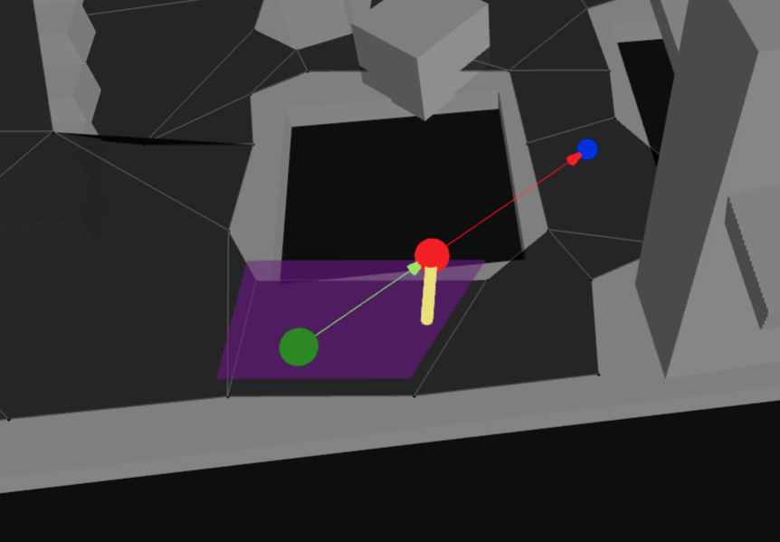

<!-- Hi README.md editors, make changes in docs/README.template.md and run `node docs/build.js` :) -->


```bash
> npm install navcat
```

# navcat

navcat is a javascript navigation mesh construction and querying library for 3D floor-based navigation.

**Features**

- Navigation mesh generation from 3D geometry
- Navigation mesh querying
- Single and multi-tile navigation mesh support
- Pure javascript - no wasm
- Fully JSON serializable data structures
- Tiny - 40.32 kB minified + gzipped

**Examples**

<table>
  <tr>
    <td align="center">
      <a href="https://navcat.dev/examples#example-example-crowd-simulation">
        <br/>
        Crowd Simulation
      </a>
    </td>
    <td align="center">
      <a href="https://navcat.dev/examples#example-example-navmesh-constrained-character-controller">
        <br/>
        Navmesh Constrained Character Controller
      </a>
    </td>
    <td align="center">
      <a href="https://navcat.dev/examples#example-example-flow-field-pathfinding">
        <br/>
        Flow Field Pathfinding
      </a>
    </td>
  </tr>
  <tr>
    <td align="center">
      <a href="https://navcat.dev/examples#example-example-solo-navmesh">
        <br/>
        Solo NavMesh
      </a>
    </td>
    <td align="center">
      <a href="https://navcat.dev/examples#example-example-tiled-navmesh">
        <br/>
        Tiled NavMesh
      </a>
    </td>
    <td align="center">
      <a href="https://navcat.dev/examples#example-example-flood-fill-pruning">
        <br/>
        Flood Fill Pruning
      </a>
    </td>
  </tr>
  <tr>
    <td align="center">
      <a href="https://navcat.dev/examples#example-example-find-path">
        <br/>
        Find Path
      </a>
    </td>
    <td align="center">
      <a href="https://navcat.dev/examples#example-example-find-smooth-path">
        <br/>
        Find Smooth Path
      </a>
    </td>
    <td align="center">
      <a href="https://navcat.dev/examples#example-example-off-mesh-connections">
        <br/>
        Off-Mesh Connections
      </a>
    </td>
  </tr>
  <tr>
    <td align="center">
      <a href="https://navcat.dev/examples#example-example-raycast">
        <br/>
        Raycast
      </a>
    </td>
    <td align="center">
      <a href="https://navcat.dev/examples#example-example-move-along-surface">
        <br/>
        Move Along Surface
      </a>
    </td>
    <td align="center">
      <a href="https://navcat.dev/examples#example-example-find-nearest-poly">
        <br/>
        Find Nearest Poly
      </a>
    </td>
  </tr>
  <tr>
    <td align="center">
      <a href="https://navcat.dev/examples#example-example-find-random-point">
        <br/>
        Find Random Point
      </a>
    </td>
    <td align="center">
      <a href="https://navcat.dev/examples#example-example-find-random-point-around-circle">
        <br/>
        Find Random Point Around Circle
      </a>
    </td>
  </tr>
</table>


## Introduction

### What is a navigation mesh?

A navigation mesh (or navmesh) is a simplified representation of a 3D environment that is used for pathfinding and AI navigation in video games and simulations. It consists of interconnected polygons that define walkable areas within the environment. These polygons are connected by edges and off-mesh connections, allowing agents (characters) to move from one polygon to another.


### The navcat navigation mesh structure

In navcat, a navigation mesh is represented as a graph of `nodes` and `links`.

Each `node` represents either a polygon in the navigation mesh or an off-mesh connection.

Each `link` represents a connection between two nodes, either between two polygons if they share an edge, or between a polygon and an off-mesh connection.

The "navigation mesh" object itself can contain many tiles in a grid, where navcat will stitch together the tiles into the global `nodes` and `links` used for pathfinding.

Because the navigation mesh is a fully JSON-serializable data structure, you can easily save and load navigation meshes to/from disk, or send them over a network. It is as simple as `JSON.stringify(navMesh)` and `JSON.parse(navMeshJsonString)`, really.

The navigation mesh data is transparent enough that you can write your own logic to traverse the navigation mesh graph if you need to.

## Can navcat be integrated with XYZ?

navcat is agnostic of other javascript libraries, but should work well with any of them.

There are some built-in utilities for creating debug visualisations with threejs. But navcat will work well with any javascript engine - Babylon.js, PlayCanvas, Three.js, or your own engine.

navcat works with vector3's that adhere to the OpenGL conventions:
- Uses the right-handed coordinate system
- Indices should be in counter-clockwise winding order

If your environment uses a different coordinate system, you will need to transform coordinates going into and out of navcat.

## How are navigation meshes generated with navcat?

The core of the navigation mesh generation approach is based on the [recastnavigation library](https://github.com/recastnavigation/recastnavigation)'s voxelization-based approach to navigation mesh generation.

At a high-level:
- Input triangles are rasterized into voxels / into a heightfield
- Voxels in areas where agents (defined by your parameters) would not be able to move are filtered and removed
- Walkable areas described by the voxel grid are divided into sets of polygonal regions
- Navigation mesh polygons are created by triangulating the generated polygonal regions

Like recast, navcat supports both single and tiled navigation meshes. Single-tile meshes are suitable for many simple, static cases and are easy to work with. Tiled navmeshes are more complex to work with but better support larger, more dynamic environments, and enable advanced use cases like re-baking, navmesh data-streaming.

Below is an overview of the steps involved in generating a "solo" / single-tile navigation mesh from a set of input triangles. If you want a copy-and-pasteable starter, see the examples:
- https://navcat.dev/examples#example-generate-navmesh
- [./examples/src/example-solo-navmesh.ts](./examples/src/example-solo-navmesh.ts)
- [./examples/src/common/generate-solo-nav-mesh.ts](./examples/src/common/generate-solo-nav-mesh.ts)

### 0. Input and setup

The input to the navigation mesh generation process is a set of 3D triangles that define the environment. These triangles should represent the collision surfaces in the environment, and shouldn't include any non-collidable decorative geometry that shouldn't affect navigation.

The input positions should adhere to the OpenGL conventions (right-handed coordinate system, counter-clockwise winding order).

The navigation mesh generation process emits diagnostic messages, warnings, and errors. These are captured with a build context object.

```ts
import * as Nav from 'navcat';
import type { Vec3, Box3 } from 'maaths';

// flat array of vertex positions [x1, y1, z1, x2, y2, z2, ...]
const positions: number[] = [];

// flat array of triangle vertex indices
const indices: number[] = [];

// build context to capture diagnostic messages, warnings, and errors
const ctx = Nav.BuildContext.create();
```


### 1. Mark walkable triangles

The first step is to filter the input triangles to find the walkable triangles. This is done by checking the slope of each triangle against a maximum walkable slope angle. Triangles that are too steep are discarded.

```ts
// CONFIG: agent walkable slope angle
const walkableSlopeAngleDegrees = 45;

// allocate an array to hold the area ids for each triangle
const triAreaIds = new Uint8Array(indices.length / 3).fill(0);

// mark triangles as walkable or not depending on their slope angle
Nav.markWalkableTriangles(positions, indices, triAreaIds, walkableSlopeAngleDegrees);
```


### 2. Rasterize triangles into a heightfield, do filtering with the heightfield

The walkable triangles are then voxelized into a heightfield, taking the triangle's "walkability" into each span.

Some filtering is done to the heightfield to remove spans where a character cannot stand, and unwanted overhangs are removed. 

The heightfield resolution is configurable, and greatly affects the fidelity of the resulting navigation mesh, and the performance of the navigation mesh generation process.

```ts
// CONFIG: heightfield cell size and height, in world units
const cellSize = 0.2;
const cellHeight = 0.2;

// CONFIG: agent walkable climb
const walkableClimbWorld = 0.5; // in world units
const walkableClimbVoxels = Math.ceil(walkableClimbWorld / cellHeight);

// CONFIG: agent walkable height
const walkableHeightWorld = 1.0; // in world units
const walkableHeightVoxels = Math.ceil(walkableHeightWorld / cellHeight);

// calculate the bounds of the input geometry
const bounds: Box3 = [
    [0, 0, 0],
    [0, 0, 0],
];
Nav.calculateMeshBounds(bounds, positions, indices);

// calculate the grid size of the heightfield
const [heightfieldWidth, heightfieldHeight] = Nav.calculateGridSize([0, 0], bounds, cellSize);

// create the heightfield
const heightfield = Nav.createHeightfield(heightfieldWidth, heightfieldHeight, bounds, cellSize, cellHeight);

// rasterize the walkable triangles into the heightfield
Nav.rasterizeTriangles(ctx, heightfield, positions, indices, triAreaIds, walkableClimbVoxels);

// filter walkable surfaces
Nav.filterLowHangingWalkableObstacles(heightfield, walkableClimbVoxels);
Nav.filterLedgeSpans(heightfield, walkableHeightVoxels, walkableClimbVoxels);
Nav.filterWalkableLowHeightSpans(heightfield, walkableHeightVoxels);
```


### 3. Build compact heightfield, erode walkable area

The heightfield is then compacted to only represent the top walkable surfaces.

The compact heightfield is generally eroded by the agent radius to ensure that the resulting navigation mesh is navigable by agents of the specified radius.

```ts
// build the compact heightfield
const compactHeightfield = Nav.buildCompactHeightfield(ctx, walkableHeightVoxels, walkableClimbVoxels, heightfield);

// CONFIG: agent radius
const walkableRadiusWorld = 0.6; // in world units
const walkableRadiusVoxels = Math.ceil(walkableRadiusWorld / cellSize);

// erode the walkable area by the agent radius / walkable radius
Nav.erodeWalkableArea(walkableRadiusVoxels, compactHeightfield);
```


### 4. Build compact heightfield regions

The compact heightfield is then analyzed to identify distinct walkable regions. These regions are used to create the final navigation mesh.

Some of the region generation algorithms compute a distance field to identify regions.

```ts
// prepare for region partitioning by calculating a distance field along the walkable surface
Nav.buildDistanceField(compactHeightfield);

// CONFIG: borderSize, relevant if you are building a tiled navmesh
const borderSize = 0;

// CONFIG: minRegionArea
const minRegionArea = 8; // world units

// CONFIG: mergeRegionArea
const mergeRegionArea = 20; // world units

// partition the walkable surface into simple regions without holes
Nav.buildRegions(ctx, compactHeightfield, borderSize, minRegionArea, mergeRegionArea);
```


### 5. Build contours from compact heightfield regions

Contours are generated around the edges of the regions. These contours are simplified to reduce the number of vertices while maintaining the overall shape.

```ts
// CONFIG: maxSimplificationError
const maxSimplificationError = 1.3; // world units

// CONFIG: maxEdgeLength
const maxEdgeLength = 6.0; // world units

// trace and simplify region contours
const contourSet = Nav.buildContours(
    ctx,
    compactHeightfield,
    maxSimplificationError,
    maxEdgeLength,
    Nav.ContourBuildFlags.CONTOUR_TESS_WALL_EDGES,
);
```


### 6. Build polygon mesh from contours, build detail mesh

From the simplified contours, a polygon mesh is created. This mesh consists of convex polygons that represent the walkable areas.

A "detail triangle mesh" is also generated to capture more accurate height information for each polygon.

```ts
// CONFIG: max vertices per polygon
const maxVerticesPerPoly = 5; // 3-6, higher = less polys, but more complex polys

const polyMesh = Nav.buildPolyMesh(ctx, contourSet, maxVerticesPerPoly);

for (let polyIndex = 0; polyIndex < polyMesh.nPolys; polyIndex++) {
    // make all "areas" use a base area id of 0
    if (polyMesh.areas[polyIndex] === Nav.WALKABLE_AREA) {
        polyMesh.areas[polyIndex] = 0;
    }

    // give all base "walkable" polys all flags
    if (polyMesh.areas[polyIndex] === 0) {
        polyMesh.flags[polyIndex] = 1;
    }
}

const polyMeshDetail = Nav.buildPolyMeshDetail(ctx, polyMesh, compactHeightfield, 1.0, 1.0);
```


### 7. Assemble the navigation mesh

Finally, the polygon mesh and detail mesh are combined to create a navigation mesh tile. This tile can be used for pathfinding and navigation queries.

```ts
// create the navigation mesh
const navMesh = Nav.createNavMesh();

// set the navmesh parameters using the poly mesh bounds
navMesh.tileWidth = polyMesh.bounds[1][0] - polyMesh.bounds[0][0];
navMesh.tileHeight = polyMesh.bounds[1][2] - polyMesh.bounds[0][2];
navMesh.origin[0] = polyMesh.bounds[0][0];
navMesh.origin[1] = polyMesh.bounds[0][1];
navMesh.origin[2] = polyMesh.bounds[0][2];

// convert the poly mesh to a navmesh tile polys
const tilePolys = Nav.polyMeshToTilePolys(polyMesh);

// convert the poly mesh detail to a navmesh tile detail mesh
const tileDetailMesh = Nav.polyMeshDetailToTileDetailMesh(tilePolys.polys, maxVerticesPerPoly, polyMeshDetail);

// create the navmesh tile
const tile: Nav.NavMeshTile = {
    id: -1,
    bounds: polyMesh.bounds,
    vertices: tilePolys.vertices,
    polys: tilePolys.polys,
    detailMeshes: tileDetailMesh.detailMeshes,
    detailVertices: tileDetailMesh.detailVertices,
    detailTriangles: tileDetailMesh.detailTriangles,
    tileX: 0,
    tileY: 0,
    tileLayer: 0,
    bvTree: null,
    cellSize,
    cellHeight,
    walkableHeight: walkableHeightWorld,
    walkableRadius: walkableRadiusWorld,
    walkableClimb: walkableClimbWorld,
};

// OPTIONAL: build a bounding volume tree to accelerate spatial queries for this tile
Nav.buildNavMeshBvTree(tile);

// add the tile to the navmesh
Nav.addTile(navMesh, tile);
```

## Navigation Mesh Querying

### findPath

```ts
const start: Vec3 = [1, 0, 1];
const end: Vec3 = [8, 0, 8];
const halfExtents: Vec3 = [0.5, 0.5, 0.5];

// find a path from start to end
const findPathResult = Nav.findPath(navMesh, start, end, halfExtents, Nav.DEFAULT_QUERY_FILTER);

if (findPathResult.success) {
    const points = findPathResult.path.map((p) => p.position);
    console.log('path points:', points); // [ [x1, y1, z1], [x2, y2, z2], ... ]
}
```

```ts
/**
 * Find a path between two positions on a NavMesh.
 *
 * If the end node cannot be reached through the navigation graph,
 * the last node in the path will be the nearest the end node.
 *
 * Internally:
 * - finds the closest poly for the start and end positions with @see findNearestPoly
 * - finds a nav mesh node path with @see findNodePath
 * - finds a straight path with @see findStraightPath
 *
 * If you want more fine tuned behaviour you can call these methods directly.
 * For example, for agent movement you might want to find a node path once but regularly re-call @see findStraightPath
 *
 * @param navMesh The navigation mesh.
 * @param start The starting position in world space.
 * @param end The ending position in world space.
 * @param queryFilter The query filter.
 * @returns The result of the pathfinding operation.
 */
export function findPath(navMesh: NavMesh, start: Vec3, end: Vec3, halfExtents: Vec3, queryFilter: QueryFilter): FindPathResult;
```

### findNearestPoly

```ts
const position: Vec3 = [1, 0, 1];
const halfExtents: Vec3 = [0.5, 0.5, 0.5];

// find the nearest nav mesh poly node to the position
const findNearestPolyResult = Nav.createFindNearestPolyResult();
Nav.findNearestPoly(
    findNearestPolyResult,
    navMesh,
    position,
    halfExtents,
    Nav.DEFAULT_QUERY_FILTER,
);

console.log(findNearestPolyResult.success); // true if a nearest poly was found
console.log(findNearestPolyResult.nearestPolyRef); // the nearest poly's node ref, or 0 if none found
console.log(findNearestPolyResult.nearestPoint); // the nearest point on the poly in world space [x, y, z]
```

```ts
export function findNearestPoly(result: FindNearestPolyResult, navMesh: NavMesh, center: Vec3, halfExtents: Vec3, queryFilter: QueryFilter): FindNearestPolyResult;
```

### getClosestPointOnPoly

```ts
const polyRef = findNearestPolyResult.nearestPolyRef;
const getClosestPointOnPolyResult = Nav.createGetClosestPointOnPolyResult();

Nav.getClosestPointOnPoly(
    getClosestPointOnPolyResult,
    navMesh,
    polyRef,
    position,
);

console.log(getClosestPointOnPolyResult.success); // true if a closest point was found
console.log(getClosestPointOnPolyResult.isOverPoly); // true if the position was inside the poly
console.log(getClosestPointOnPolyResult.closestPoint); // the closest point on the poly in world space [x, y, z]
```

```ts
export function getClosestPointOnPoly(result: GetClosestPointOnPolyResult, navMesh: NavMesh, ref: NodeRef, point: Vec3): GetClosestPointOnPolyResult;
```

### findNodePath

```ts
const start: Vec3 = [1, 0, 1];
const end: Vec3 = [8, 0, 8];
const halfExtents: Vec3 = [0.5, 0.5, 0.5];

// find the nearest nav mesh poly node to the start position
const startNode = Nav.findNearestPoly(
    Nav.createFindNearestPolyResult(),
    navMesh,
    start,
    halfExtents,
    Nav.DEFAULT_QUERY_FILTER,
);

// find the nearest nav mesh poly node to the end position
const endNode = Nav.findNearestPoly(Nav.createFindNearestPolyResult(), navMesh, end, halfExtents, Nav.DEFAULT_QUERY_FILTER);

// find a "node" path from start to end
if (startNode.success && endNode.success) {
    const nodePath = Nav.findNodePath(
        navMesh,
        startNode.nearestPolyRef,
        endNode.nearestPolyRef,
        startNode.nearestPoint,
        endNode.nearestPoint,
        Nav.DEFAULT_QUERY_FILTER,
    );

    console.log('node path success:', nodePath.success); // true if a partial or full path was found
    console.log('node path:', nodePath.path); // ['0.0.1', '0.0.5', '0.0.8', ... ]
}
```

```ts
/**
 * Find a path between two nodes.
 *
 * If the end node cannot be reached through the navigation graph,
 * the last node in the path will be the nearest the end node.
 *
 * The start and end positions are used to calculate traversal costs.
 * (The y-values impact the result.)
 *
 * @param startRef The reference ID of the starting node.
 * @param endRef The reference ID of the ending node.
 * @param startPos The starting position in world space.
 * @param endPos The ending position in world space.
 * @param filter The query filter.
 * @returns The result of the pathfinding operation.
 */
export function findNodePath(navMesh: NavMesh, startRef: NodeRef, endRef: NodeRef, startPos: Vec3, endPos: Vec3, filter: QueryFilter): FindNodePathResult;
```

### findStraightPath

```ts
const start: Vec3 = [1, 0, 1];
const end: Vec3 = [8, 0, 8];

// array of nav mesh node refs, often retrieved from a call to findNodePath
const findStraightPathNodes: Nav.NodeRef[] = [
    /* ... */
];

// find the nearest nav mesh poly node to the start position
const straightPathResult = Nav.findStraightPath(navMesh, start, end, findStraightPathNodes);

console.log('straight path success:', straightPathResult.success); // true if a partial or full path was found
console.log('straight path:', straightPathResult.path); // [ { position: [x, y, z], nodeType: NodeType, nodeRef: NodeRef }, ... ]
```

```ts
/**
 * This method peforms what is often called 'string pulling'.
 *
 * The start position is clamped to the first polygon node in the path, and the
 * end position is clamped to the last. So the start and end positions should
 * normally be within or very near the first and last polygons respectively.
 *
 * @param navMesh The navigation mesh to use for the search.
 * @param start The start position in world space.
 * @param end The end position in world space.
 * @param pathNodeRefs The list of polygon node references that form the path, generally obtained from `findNodePath`
 * @param maxPoints The maximum number of points to return in the straight path. If null, no limit is applied.
 * @param straightPathOptions @see FindStraightPathOptions
 * @returns The straight path
 */
export function findStraightPath(navMesh: NavMesh, start: Vec3, end: Vec3, pathNodeRefs: NodeRef[], maxPoints: number | null = null, straightPathOptions = 0): FindStraightPathResult;
```

### moveAlongSurface

```ts
const start: Vec3 = [1, 0, 1];
const end: Vec3 = [8, 0, 8];
const halfExtents: Vec3 = [0.5, 0.5, 0.5];

const startNode = Nav.findNearestPoly(
    Nav.createFindNearestPolyResult(),
    navMesh,
    start,
    halfExtents,
    Nav.DEFAULT_QUERY_FILTER,
);

const moveAlongSurfaceResult = Nav.moveAlongSurface(navMesh, startNode.nearestPolyRef, start, end, Nav.DEFAULT_QUERY_FILTER);

console.log(moveAlongSurfaceResult.success); // true if the move was successful
console.log(moveAlongSurfaceResult.resultPosition); // the resulting position after the move [x, y, z]
console.log(moveAlongSurfaceResult.resultRef); // the resulting poly node ref after the move, or 0 if none
console.log(moveAlongSurfaceResult.visited); // array of node refs that were visited during the move
```

```ts
/**
 * Moves from start position towards end position along the navigation mesh surface.
 *
 * This method is optimized for small delta movement and a small number of
 * polygons. If used for too great a distance, the result set will form an
 * incomplete path.
 *
 * The resultPosition will equal the endPosition if the end is reached.
 * Otherwise the closest reachable position will be returned.
 *
 * The resulting position is projected onto the surface of the navigation mesh with @see getPolyHeight.
 *
 * @param result The result object to populate
 * @param navMesh The navigation mesh
 * @param startRef The reference ID of the starting polygon
 * @param startPosition The starting position [(x, y, z)]
 * @param endPosition The ending position [(x, y, z)]
 * @param filter The query filter.
 * @returns Result containing status, final position, and visited polygons
 */
export function moveAlongSurface(navMesh: NavMesh, startRef: NodeRef, startPosition: Vec3, endPosition: Vec3, filter: QueryFilter): MoveAlongSurfaceResult;
```

### raycast

```ts
const start: Vec3 = [1, 0, 1];
const end: Vec3 = [8, 0, 8];
const halfExtents: Vec3 = [0.5, 0.5, 0.5];

const startNode = Nav.findNearestPoly(
    Nav.createFindNearestPolyResult(),
    navMesh,
    start,
    halfExtents,
    Nav.DEFAULT_QUERY_FILTER,
);

const raycastResult = Nav.raycast(navMesh, startNode.nearestPolyRef, start, end, Nav.DEFAULT_QUERY_FILTER);

console.log(raycastResult.t); // the normalized distance along the ray where an obstruction was found, or 1.0 if none
console.log(raycastResult.hitNormal); // the normal of the obstruction hit, or [0, 0, 0] if none
console.log(raycastResult.hitEdgeIndex); // the index of the edge of the poly that was hit, or -1 if none
console.log(raycastResult.path); // array of node refs that were visited during the raycast
```

```ts
/**
 * Casts a 'walkability' ray along the surface of the navigation mesh from
 * the start position toward the end position.
 *
 * This method is meant to be used for quick, short distance checks.
 * The raycast ignores the y-value of the end position (2D check).
 *
 * @param navMesh The navigation mesh to use for the raycast.
 * @param startRef The NodeRef for the start polygon
 * @param startPosition The starting position in world space.
 * @param endPosition The ending position in world space.
 * @param filter The query filter to apply.
 */
export function raycast(navMesh: NavMesh, startRef: NodeRef, startPosition: Vec3, endPosition: Vec3, filter: QueryFilter): RaycastResult;
```

### getPolyHeight

```ts
const position: Vec3 = [1, 0, 1];
const halfExtents: Vec3 = [0.5, 0.5, 0.5];

const nearestPoly = Nav.findNearestPoly(
    Nav.createFindNearestPolyResult(),
    navMesh,
    position,
    halfExtents,
    Nav.DEFAULT_QUERY_FILTER,
);

const tileAndPoly = Nav.getTileAndPolyByRef(nearestPoly.nearestPolyRef, navMesh);

if (nearestPoly.success) {
    const getPolyHeightResult = Nav.createGetPolyHeightResult();
    Nav.getPolyHeight(getPolyHeightResult, tileAndPoly.tile!, tileAndPoly.poly!, tileAndPoly.polyIndex, position);

    console.log(getPolyHeightResult.success); // true if a height was found
    console.log(getPolyHeightResult.height); // the height of the poly at the position
}
```

```ts
/**
 * Gets the height of a polygon at a given point using detail mesh if available.
 * @param result The result object to populate
 * @param tile The tile containing the polygon
 * @param poly The polygon
 * @param polyIndex The index of the polygon in the tile
 * @param pos The position to get height for
 * @returns The result object with success flag and height
 */
export function getPolyHeight(result: GetPolyHeightResult, tile: NavMeshTile, poly: NavMeshPoly, polyIndex: number, pos: Vec3): GetPolyHeightResult;
```

### findRandomPoint

```ts
const randomPoint = Nav.findRandomPoint(navMesh, Nav.DEFAULT_QUERY_FILTER, Math.random);

console.log(randomPoint.success); // true if a random point was found
console.log(randomPoint.position); // [x, y, z]
console.log(randomPoint.ref); // the poly node ref that the random point is on
```

```ts
/**
 * Finds a random point on the navigation mesh.
 *
 * @param navMesh - The navigation mesh
 * @param filter - Query filter to apply to polygons
 * @param rand - Function that returns random values [0,1]
 * @returns The result object with success flag, random point, and polygon reference
 */
export function findRandomPoint(navMesh: NavMesh, filter: QueryFilter, rand: () => number): FindRandomPointResult;
```

### findRandomPointAroundCircle

```ts
const center: Vec3 = [5, 0, 5];
const radius = 3.0; // world units

const halfExtents: Vec3 = [0.5, 0.5, 0.5];

const centerNode = Nav.findNearestPoly(
    Nav.createFindNearestPolyResult(),
    navMesh,
    center,
    halfExtents,
    Nav.DEFAULT_QUERY_FILTER,
);

if (centerNode.success) {
    const randomPointAroundCircle = Nav.findRandomPointAroundCircle(
        navMesh,
        centerNode.nearestPolyRef,
        center,
        radius,
        Nav.DEFAULT_QUERY_FILTER,
        Math.random,
    );

    console.log(randomPointAroundCircle.success); // true if a random point was found
    console.log(randomPointAroundCircle.position); // [x, y, z]
    console.log(randomPointAroundCircle.randomRef); // the poly node ref that the random point is on
}
```

```ts
/**
 * Finds a random point within a circle around a center position on the navigation mesh.
 *
 * Uses Dijkstra-like search to explore reachable polygons within the circle,
 * then selects a random polygon weighted by area, and finally generates
 * a random point within that polygon.
 *
 * @param result - Result object to store the random point and polygon reference
 * @param navMesh - The navigation mesh
 * @param startRef - Reference to the polygon to start the search from
 * @param centerPosition - Center position of the search circle
 * @param maxRadius - Maximum radius of the search circle
 * @param filter - Query filter to apply to polygons
 * @param rand - Function that returns random values [0,1]
 * @returns The result object with success flag, random point, and polygon reference
 */
export function findRandomPointAroundCircle(navMesh: NavMesh, startRef: NodeRef, centerPosition: Vec3, maxRadius: number, filter: QueryFilter, rand: () => number): FindRandomPointAroundCircleResult;
```

## Navigation Mesh Debugging

...

## Off-mesh Connections

...

## Tiled Navigation Meshes

...

## BYO Navigation Meshes

...

## Acknowledgements

...

