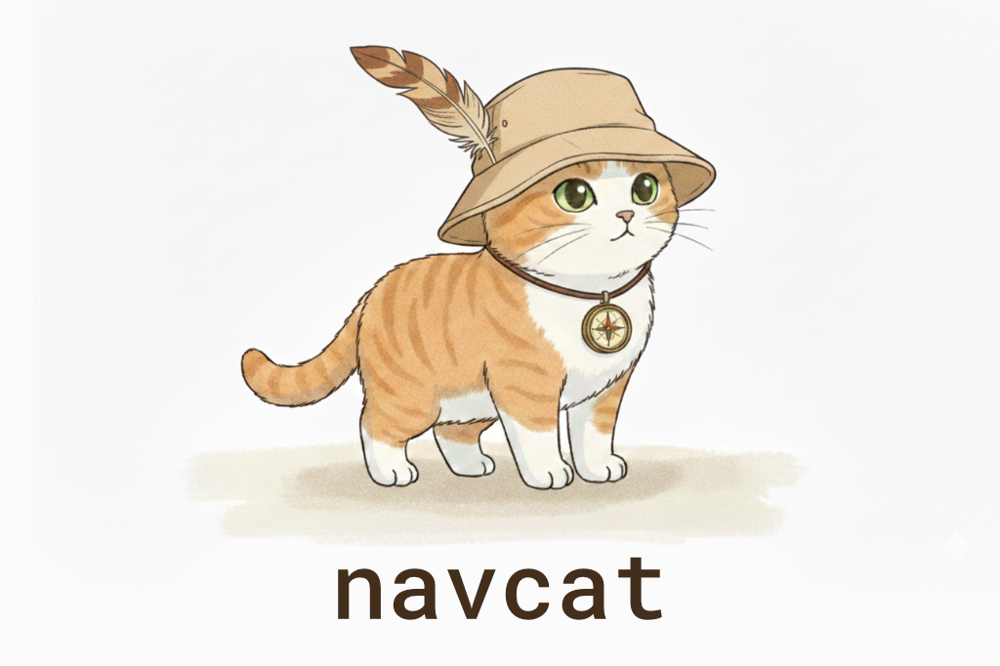

```bash
> npm install navcat
```

# navcat

navcat is a javascript navigation mesh construction and querying library for 3D floor-based navigation.

**Features**

- Navigation mesh generation from 3D geometry
- Navigation mesh querying
- Single and multi-tile navigation mesh support
- Pure javascript - no wasm
- Fully JSON serializable data structures
- Tiny - 40.32 kB minified + gzipped

**Showcase Examples**

<table>
  <tr>
    <td align="center">
      <a href="https://navcat.dev/examples#example-find-path">
        <br/>
        A* Pathfinding
      </a>
    </td>
    <td align="center">
      <a href="https://navcat.dev/examples#example-navmesh-constrained-controller">
        <br/>
        Character Controllers
      </a>
    </td>
    <td align="center">
      <a href="https://navcat.dev/examples#example-crowd-simulation">
        <br/>
        Crowd Simulation
      </a>
    </td>
    <td align="center">
      <a href="https://navcat.dev/examples#example-flow-field">
        <br/>
        Flow Field Pathfinding
      </a>
    </td>
  </tr>
</table>

## Can navcat be used with XYZ?

navcat is agnostic of other javascript libraries, but should work well with any of them.

There are some built-in utilities for creating debug visualisations with threejs. But navcat will work well with any javascript engine - Babylon.js, PlayCanvas, Three.js, or your own engine.

navcat works with vector3's that adhere to the OpenGL conventions:
- Uses the right-handed coordinate system
- Indices should be in counter-clockwise winding order

If your environment uses a different coordinate system, you will need to transform coordinates going into and out of navcat.

## What's a navigation mesh?

A navigation mesh (or navmesh) is a simplified representation of a 3D environment that is used for pathfinding and AI navigation in video games and simulations. It consists of interconnected polygons (usually triangles or convex shapes) that define walkable areas within the environment. These polygons are connected by edges, allowing characters or agents to move from one polygon to another.


## How are navigation meshes generated with navcat?

The core of the navigation mesh generation approach is based on the [recastnavigation library](https://github.com/recastnavigation/recastnavigation)'s voxelization-based approach to navigation mesh generation.

At a high-level:
- Input triangles are rasterized into voxels / into a heightfield
- Voxels in areas where agents (defined by your parameters) would not be able to move are filtered and removed
- Walkable areas described by the voxel grid are divided into sets of polygonal regions
- Navigation mesh polygons are created by triangulating the generated polygonal regions

Like recast, navcat supports both single and tiled navigation meshes. Single-tile meshes are suitable for many simple, static cases and are easy to work with. Tiled navmeshes are more complex to work with but better support larger, more dynamic environments, and enable advanced use cases like re-baking, navmesh data-streaming.

Below is an overview of the steps involved in generating a "solo" / single-tile navigation mesh from a set of input triangles. If you want a copy-and-pasteable starter, see the examples:
- https://navcat.dev/examples#example-generate-navmesh
- [./examples/src/example-solo-navmesh.ts](./examples/src/example-solo-navmesh.ts)
- [./examples/src/common/generate-solo-nav-mesh.ts](./examples/src/common/generate-solo-nav-mesh.ts)

### 0. Input and setup

The input to the navigation mesh generation process is a set of 3D triangles that define the environment. These triangles should represent the collision surfaces in the environment, and shouldn't include any non-collidable decorative geometry that shouldn't affect navigation.

The input positions should adhere to the OpenGL conventions (right-handed coordinate system, counter-clockwise winding order).

The navigation mesh generation process emits diagnostic messages, warnings, and errors. These are captured with a build context object.

<!--example-start-->
```ts
import * as Nav from 'navcat';

// flat array of vertex positions [x1, y1, z1, x2, y2, z2, ...]
const positions: number[] = [];

// flat array of triangle vertex indices
const indices: number[] = [];

// build context to capture diagnostic messages, warnings, and errors
const ctx = Nav.BuildContext.create();
```
<!--example-end-->


### 1. Mark walkable triangles

The first step is to filter the input triangles to find the walkable triangles. This is done by checking the slope of each triangle against a maximum walkable slope angle. Triangles that are too steep are discarded.

<!--example-start-->
```ts
// CONFIG: agent walkable slope angle
const walkableSlopeAngleDegrees = 45;

// allocate an array to hold the area ids for each triangle
const triAreaIds = new Uint8Array(indices.length / 3).fill(0);

// mark triangles as walkable or not depending on their slope angle
Nav.markWalkableTriangles(positions, indices, triAreaIds, walkableSlopeAngleDegrees);
```
<!--example-end-->


### 2. Rasterize triangles into a heightfield, do filtering with the heightfield

The walkable triangles are then voxelized into a heightfield, taking the triangle's "walkability" into each span.

Some filtering is done to the heightfield to remove spans where a character cannot stand, and unwanted overhangs are removed. 

The heightfield resolution is configurable, and greatly affects the fidelity of the resulting navigation mesh, and the performance of the navigation mesh generation process.

<!--example-start-->
```ts
// CONFIG: heightfield cell size and height, in world units
const cellSize = 0.2;
const cellHeight = 0.2;

// CONFIG: agent walkable climb
const walkableClimbWorld = 0.5; // in world units
const walkableClimbVoxels = Math.ceil(walkableClimbWorld / cellHeight);

// CONFIG: agent walkable height
const walkableHeightWorld = 1.0; // in world units
const walkableHeightVoxels = Math.ceil(walkableHeightWorld / cellHeight);

// calculate the bounds of the input geometry
const bounds = Nav.calculateMeshBounds(box3.create(), positions, indices);

// calculate the grid size of the heightfield
const [heightfieldWidth, heightfieldHeight] = Nav.calculateGridSize(vec2.create(), bounds, cellSize);

// create the heightfield
const heightfield = Nav.createHeightfield(heightfieldWidth, heightfieldHeight, bounds, cellSize, cellHeight);

// rasterize the walkable triangles into the heightfield
Nav.rasterizeTriangles(ctx, heightfield, positions, indices, triAreaIds, walkableClimbVoxels);

// filter walkable surfaces
Nav.filterLowHangingWalkableObstacles(heightfield, walkableClimbVoxels);
Nav.filterLedgeSpans(heightfield, walkableHeightVoxels, walkableClimbVoxels);
Nav.filterWalkableLowHeightSpans(heightfield, walkableHeightVoxels);
```
<!--example-end-->


### 3. Build compact heightfield, erode walkable area

The heightfield is then compacted to only represent the top walkable surfaces.

The compact heightfield is generally eroded by the agent radius to ensure that the resulting navigation mesh is navigable by agents of the specified radius.

<!--example-start-->
```ts
// build the compact heightfield
const compactHeightfield = Nav.buildCompactHeightfield(ctx, walkableHeightVoxels, walkableClimbVoxels, heightfield);

// CONFIG: agent radius
const walkableRadiusWorld = 0.6; // in world units
const walkableRadiusVoxels = Math.ceil(walkableRadiusWorld / cellSize);

// erode the walkable area by the agent radius / walkable radius
Nav.erodeWalkableArea(walkableRadiusVoxels, compactHeightfield);
```
<!--example-end-->


### 4. Build compact heightfield regions

The compact heightfield is then analyzed to identify distinct walkable regions. These regions are used to create the final navigation mesh.

Some of the region generation algorithms compute a distance field to identify regions.

<!--example-start-->
```ts
// prepare for region partitioning by calculating a distance field along the walkable surface
Nav.buildDistanceField(compactHeightfield);

// CONFIG: borderSize, relevant if you are building a tiled navmesh
const borderSize = 0;

// CONFIG: minRegionArea
const minRegionArea = 8; // world units

// CONFIG: mergeRegionArea
const mergeRegionArea = 20; // world units

// partition the walkable surface into simple regions without holes
Nav.buildRegions(ctx, compactHeightfield, borderSize, minRegionArea, mergeRegionArea);
```
<!--example-end-->


### 5. Build contours from compact heightfield regions

Contours are generated around the edges of the regions. These contours are simplified to reduce the number of vertices while maintaining the overall shape.

<!--example-start-->
```ts
// CONFIG: maxSimplificationError
const maxSimplificationError = 1.3; // world units

// CONFIG: maxEdgeLength
const maxEdgeLength = 6.0; // world units

// trace and simplify region contours
const contourSet = Nav.buildContours(
    ctx,
    compactHeightfield,
    maxSimplificationError,
    maxEdgeLength,
    ContourBuildFlags.CONTOUR_TESS_WALL_EDGES,
);
```
<!--example-end-->


### 6. Build polygon mesh from contours, build detail mesh

From the simplified contours, a polygon mesh is created. This mesh consists of convex polygons that represent the walkable areas.

A "detail triangle mesh" is also generated to capture more accurate height information for each polygon.

<!--example-start-->
```ts
// CONFIG: max vertices per polygon
const maxVerticesPerPoly = 5; // 3-6, higher = less polys, but more complex polys

const polyMesh = Nav.buildPolyMesh(ctx, contourSet, maxVerticesPerPoly);

for (let polyIndex = 0; polyIndex < polyMesh.nPolys; polyIndex++) {
    // make all "areas" use a base area id of 0
    if (polyMesh.areas[polyIndex] === WALKABLE_AREA) {
        polyMesh.areas[polyIndex] = 0;
    }

    // give all base "walkable" polys all flags 
    if (polyMesh.areas[polyIndex] === 0) {
        polyMesh.flags[polyIndex] = 1;
    }
}
```
<!--example-end-->


### 7. Assemble the navigation mesh

Finally, the polygon mesh and detail mesh are combined to create a navigation mesh tile. This tile can be used for pathfinding and navigation queries.

<!--example-start-->
```ts
// create the navigation mesh
const navMesh = Nav.createNavMesh();

// set the navmesh parameters using the poly mesh bounds
nav.tileWidth = polyMesh.bounds[1][0] - polyMesh.bounds[0][0];
nav.tileHeight = polyMesh.bounds[1][2] - polyMesh.bounds[0][2];
nav.origin[0] = polyMesh.bounds[0][0];
nav.origin[1] = polyMesh.bounds[0][1];
nav.origin[2] = polyMesh.bounds[0][2];

// convert the poly mesh to a navmesh tile polys
const tilePolys = Nav.polyMeshToTilePolys(polyMesh);

// convert the poly mesh detail to a navmesh tile detail mesh
const tileDetailMesh = Nav.polyMeshDetailToTileDetailMesh(tilePolys.polys, maxVerticesPerPoly, polyMeshDetail);

// create the navmesh tile
const tile: Nav.NavMeshTile = {
    id: -1,
    bounds: polyMesh.bounds,
    vertices: tilePolys.vertices,
    polys: tilePolys.polys,
    detailMeshes: tileDetailMesh.detailMeshes,
    detailVertices: tileDetailMesh.detailVertices,
    detailTriangles: tileDetailMesh.detailTriangles,
    tileX: 0,
    tileY: 0,
    tileLayer: 0,
    bvTree: null,
    cellSize,
    cellHeight,
    walkableHeight: walkableHeightWorld,
    walkableRadius: walkableRadiusWorld,
    walkableClimb: walkableClimbWorld,
};

// OPTIONAL: build a bounding volume tree to accelerate spatial queries for this tile
Nav.buildNavMeshBvTree(tile);

// add the tile to the navmesh
Nav.addTile(nav, tile);
```
<!--example-end-->

## Navigation Mesh Debugging

...

## Navigation Mesh Structure

...

### Navigation Mesh Serialization & Deserialization

All navigation mesh data structures in navcat are fully JSON serializable. This means you can easily save and load navigation meshes to/from disk, or send them over a network.

It is as simple as `JSON.stringify(navMesh)` and `JSON.parse(navMeshJsonString)`, really.

## Navigation Mesh Querying

...

## Off-mesh Connections

...

## Tiled Navigation Meshes

...

## BYO Navigation Meshes

...

## Acknowledgements

...

