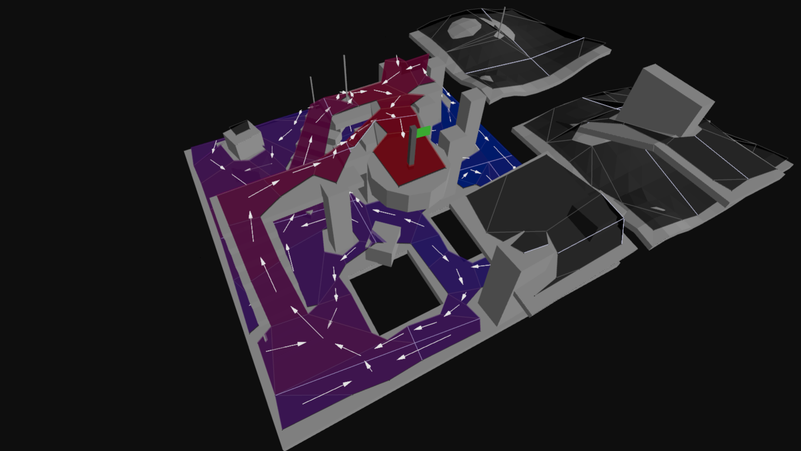

<!-- Hi README.md editors, make changes in docs/README.template.md and run `node docs/build.js` :) -->


```bash
> npm install navcat
```

# navcat

navcat is a javascript navigation mesh construction and querying library for 3D floor-based navigation.

**Features**

- Navigation mesh generation from 3D geometry
- Navigation mesh querying
- Single and multi-tile navigation mesh support
- Pure javascript - no wasm
- Fully JSON serializable data structures
- Tiny - 40.32 kB minified + gzipped

**Examples**

<table>
  <tr>
    <td align="center">
      <a href="https://navcat.dev#example-crowd-simulation">
        <br/>
        Crowd Simulation
      </a>
    </td>
    <td align="center">
      <a href="https://navcat.dev#example-navmesh-constrained-character-controller">
        <br/>
        Navmesh Constrained Character Controller
      </a>
    </td>
    <td align="center">
      <a href="https://navcat.dev#example-flow-field-pathfinding">
        <br/>
        Flow Field Pathfinding
      </a>
    </td>
  </tr>
  <tr>
    <td align="center">
      <a href="https://navcat.dev#example-custom-areas">
        <br/>
        Custom Areas
      </a>
    </td>
    <td align="center">
      <a href="https://navcat.dev#example-byo-navmesh">
        <br/>
        BYO NavMesh
      </a>
    </td>
    <td align="center">
      <a href="https://navcat.dev#example-solo-navmesh">
        <br/>
        Solo NavMesh
      </a>
    </td>
  </tr>
  <tr>
    <td align="center">
      <a href="https://navcat.dev#example-tiled-navmesh">
        <br/>
        Tiled NavMesh
      </a>
    </td>
    <td align="center">
      <a href="https://navcat.dev#example-flood-fill-pruning">
        <br/>
        Flood Fill Pruning
      </a>
    </td>
    <td align="center">
      <a href="https://navcat.dev#example-find-path">
        <br/>
        Find Path
      </a>
    </td>
  </tr>
  <tr>
    <td align="center">
      <a href="https://navcat.dev#example-find-smooth-path">
        <br/>
        Find Smooth Path
      </a>
    </td>
    <td align="center">
      <a href="https://navcat.dev#example-off-mesh-connections">
        <br/>
        Off-Mesh Connections
      </a>
    </td>
    <td align="center">
      <a href="https://navcat.dev#example-raycast">
        <br/>
        Raycast
      </a>
    </td>
  </tr>
  <tr>
    <td align="center">
      <a href="https://navcat.dev#example-move-along-surface">
        <br/>
        Move Along Surface
      </a>
    </td>
    <td align="center">
      <a href="https://navcat.dev#example-find-nearest-poly">
        <br/>
        Find Nearest Poly
      </a>
    </td>
    <td align="center">
      <a href="https://navcat.dev#example-find-random-point">
        <br/>
        Find Random Point
      </a>
    </td>
  </tr>
  <tr>
    <td align="center">
      <a href="https://navcat.dev#example-find-random-point-around-circle">
        <br/>
        Find Random Point Around Circle
      </a>
    </td>
  </tr>
</table>


## Table of Contents

- [Table of Contents](#table-of-contents)
- [Introduction](#introduction)
  - [What is a navigation mesh?](#what-is-a-navigation-mesh)
  - [The navcat navigation mesh structure](#the-navcat-navigation-mesh-structure)
  - [Can navcat be integrated with XYZ?](#can-navcat-be-integrated-with-xyz)
- [How are navigation meshes generated with navcat?](#how-are-navigation-meshes-generated-with-navcat)
  - [0. Input and setup](#0-input-and-setup)
  - [1. Mark walkable triangles](#1-mark-walkable-triangles)
  - [2. Rasterize triangles into a heightfield, do filtering with the heightfield](#2-rasterize-triangles-into-a-heightfield-do-filtering-with-the-heightfield)
  - [3. Build compact heightfield, erode walkable area, mark areas](#3-build-compact-heightfield-erode-walkable-area-mark-areas)
  - [4. Build compact heightfield regions](#4-build-compact-heightfield-regions)
  - [5. Build contours from compact heightfield regions](#5-build-contours-from-compact-heightfield-regions)
  - [6. Build polygon mesh from contours, build detail mesh](#6-build-polygon-mesh-from-contours-build-detail-mesh)
  - [7. Convert build-time poly mesh and poly mesh detail to runtime navmesh tile format](#7-convert-build-time-poly-mesh-and-poly-mesh-detail-to-runtime-navmesh-tile-format)
  - [8. Assemble the navigation mesh](#8-assemble-the-navigation-mesh)
- [Navigation Mesh Querying](#navigation-mesh-querying)
  - [findPath](#findpath)
  - [findNearestPoly](#findnearestpoly)
  - [findNodePath](#findnodepath)
  - [findStraightPath](#findstraightpath)
  - [moveAlongSurface](#movealongsurface)
  - [raycast](#raycast)
  - [getPolyHeight](#getpolyheight)
  - [findRandomPoint](#findrandompoint)
  - [findRandomPointAroundCircle](#findrandompointaroundcircle)
  - [getClosestPointOnPoly](#getclosestpointonpoly)
  - [closestPointOnDetailEdges](#closestpointondetailedges)
  - [getPortalPoints](#getportalpoints)
  - [isValidNodeRef](#isvalidnoderef)
  - [getNodeAreaAndFlags](#getnodeareaandflags)
  - [queryPolygons](#querypolygons)
  - [queryPolygonsInTile](#querypolygonsintile)
- [Custom Query Filters and Custom Area Types](#custom-query-filters-and-custom-area-types)
- [Agent / Crowd Simulation](#agent-crowd-simulation)
- [Off-Mesh Connections](#off-mesh-connections)
- [Tiled Navigation Meshes](#tiled-navigation-meshes)
- [BYO Navigation Meshes](#byo-navigation-meshes)
- [Debug Utilities](#debug-utilities)
- [Acknowledgements](#acknowledgements)

## Introduction

### What is a navigation mesh?

A navigation mesh (or navmesh) is a simplified representation of a 3D environment that is used for pathfinding and AI navigation in video games and simulations. It consists of interconnected polygons that define walkable areas within the environment. These polygons are connected by edges and off-mesh connections, allowing agents (characters) to move from one polygon to another.


### The navcat navigation mesh structure

In navcat, a navigation mesh is represented as a graph of `nodes` and `links`.

Each `node` represents either a polygon in the navigation mesh or an off-mesh connection.

Each `link` represents a connection between two nodes, either between two polygons if they share an edge, or between a polygon and an off-mesh connection.

The "navigation mesh" object itself can contain many tiles in a grid, where navcat will stitch together the tiles into the global `nodes` and `links` used for pathfinding.

Because the navigation mesh is a fully JSON-serializable data structure, you can easily save and load navigation meshes to/from disk, or send them over a network. It is as simple as `JSON.stringify(navMesh)` and `JSON.parse(navMeshJsonString)`, really.

The navigation mesh data is transparent enough that you can write your own logic to traverse the navigation mesh graph if you need to, like in the "Flow Field Pathfinding" example.

### Can navcat be integrated with XYZ?

navcat is agnostic of other javascript libraries, but should work well with any of them.

There are some built-in utilities for creating debug visualisations with threejs. But navcat will work well with any javascript engine - Babylon.js, PlayCanvas, Three.js, or your own engine.

navcat works with vector3's that adhere to the OpenGL conventions:
- Uses the right-handed coordinate system
- Indices should be in counter-clockwise winding order

If your environment uses a different coordinate system, you will need to transform coordinates going into and out of navcat.

The examples use threejs for rendering, but the core navcat APIs are completely agnostic of any rendering or game engine libraries.

## How are navigation meshes generated with navcat?

The core of the navigation mesh generation approach is based on the [recastnavigation library](https://github.com/recastnavigation/recastnavigation)'s voxelization-based approach to navigation mesh generation.

At a high-level:
- Input triangles are rasterized into voxels / into a heightfield
- Voxels in areas where agents (defined by your parameters) would not be able to move are filtered and removed
- Walkable areas described by the voxel grid are divided into sets of polygonal regions
- Navigation mesh polygons are created by triangulating the generated polygonal regions

Like recast, navcat supports both single and tiled navigation meshes. Single-tile meshes are suitable for many simple, static cases and are easy to work with. Tiled navmeshes are more complex to work with but better support larger, more dynamic environments, and enable advanced use cases like re-baking, navmesh data-streaming.

Below is an overview of the steps involved in generating a "solo" / single-tile navigation mesh from a set of input triangles. If you want a copy-and-pasteable starter, see the examples:
- https://navcat.dev/examples#example-generate-navmesh
- [./examples/src/example-solo-navmesh.ts](./examples/src/example-solo-navmesh.ts)
- [./examples/src/common/generate-solo-nav-mesh.ts](./examples/src/common/generate-solo-nav-mesh.ts)

### 0. Input and setup

The input to the navigation mesh generation process is a set of 3D triangles that define the environment. These triangles should represent the collision surfaces in the environment, and shouldn't include any non-collidable decorative geometry that shouldn't affect navigation.

The input positions should adhere to the OpenGL conventions (right-handed coordinate system, counter-clockwise winding order).

The navigation mesh generation process emits diagnostic messages, warnings, and errors. These are captured with a build context object.

```ts
import * as Nav from 'navcat';
import type { Vec3, Box3 } from 'maaths';

// flat array of vertex positions [x1, y1, z1, x2, y2, z2, ...]
const positions: number[] = [];

// flat array of triangle vertex indices
const indices: number[] = [];

// build context to capture diagnostic messages, warnings, and errors
const ctx = Nav.BuildContext.create();
```


```ts
export type BuildContextState = {
    logs: BuildContextLog[];
    times: BuildContextTime[];
    _startTimes: Record<string, number>;
};
```

### 1. Mark walkable triangles

The first step is to filter the input triangles to find the walkable triangles. This is done by checking the slope of each triangle against a maximum walkable slope angle. Triangles that are walkable are marked with the `WALKABLE_AREA` (`1`) area type.

```ts
// CONFIG: agent walkable slope angle
const walkableSlopeAngleDegrees = 45;

// allocate an array to hold the area ids for each triangle
const triAreaIds = new Uint8Array(indices.length / 3).fill(0);

// mark triangles as walkable or not depending on their slope angle
Nav.markWalkableTriangles(positions, indices, triAreaIds, walkableSlopeAngleDegrees);
```


```ts
/**
 * Marks triangles as walkable based on their slope angle
 * @param inVertices Array of vertex coordinates [x0, y0, z0, x1, y1, z1, ...]
 * @param inIndices Array of triangle indices [i0, i1, i2, i3, i4, i5, ...]
 * @param outTriAreaIds Output array of triangle area IDs, with a length equal to inIndices.length / 3
 * @param walkableSlopeAngle Maximum walkable slope angle in degrees (default: 45)
 */
export function markWalkableTriangles(inVertices: ArrayLike<number>, inIndices: ArrayLike<number>, outTriAreaIds: ArrayLike<number>, walkableSlopeAngle = 45.0);
```

### 2. Rasterize triangles into a heightfield, do filtering with the heightfield

The walkable triangles are then voxelized into a heightfield, taking the triangle's "walkability" into each span.

Some filtering is done to the heightfield to remove spans where a character cannot stand, and unwanted overhangs are removed. 

The heightfield resolution is configurable, and greatly affects the fidelity of the resulting navigation mesh, and the performance of the navigation mesh generation process.

```ts
// CONFIG: heightfield cell size and height, in world units
const cellSize = 0.2;
const cellHeight = 0.2;

// CONFIG: agent walkable climb
const walkableClimbWorld = 0.5; // in world units
const walkableClimbVoxels = Math.ceil(walkableClimbWorld / cellHeight);

// CONFIG: agent walkable height
const walkableHeightWorld = 1.0; // in world units
const walkableHeightVoxels = Math.ceil(walkableHeightWorld / cellHeight);

// calculate the bounds of the input geometry
const bounds: Box3 = [
    [0, 0, 0],
    [0, 0, 0],
];
Nav.calculateMeshBounds(bounds, positions, indices);

// calculate the grid size of the heightfield
const [heightfieldWidth, heightfieldHeight] = Nav.calculateGridSize([0, 0], bounds, cellSize);

// create the heightfield
const heightfield = Nav.createHeightfield(heightfieldWidth, heightfieldHeight, bounds, cellSize, cellHeight);

// rasterize the walkable triangles into the heightfield
Nav.rasterizeTriangles(ctx, heightfield, positions, indices, triAreaIds, walkableClimbVoxels);

// filter walkable surfaces
Nav.filterLowHangingWalkableObstacles(heightfield, walkableClimbVoxels);
Nav.filterLedgeSpans(heightfield, walkableHeightVoxels, walkableClimbVoxels);
Nav.filterWalkableLowHeightSpans(heightfield, walkableHeightVoxels);
```


```ts
export type Heightfield = {
    /** the width of the heightfield (along x axis in cell units) */
    width: number;
    /** the height of the heightfield (along z axis in cell units) */
    height: number;
    /** the bounds in world space */
    bounds: Box3;
    /** the vertical size of each cell (minimum increment along y) */
    cellHeight: number;
    /** the vertical size of each cell (minimum increment along x and z) */
    cellSize: number;
    /** the heightfield of spans, (width*height) */
    spans: (HeightfieldSpan | null)[];
};
```

```ts
export type HeightfieldSpan = {
    /** the lower limit of the span */
    min: number;
    /** the upper limit of the span */
    max: number;
    /** the area id assigned to the span */
    area: number;
    /** the next heightfield span */
    next: HeightfieldSpan | null;
};
```

```ts
export function calculateMeshBounds(outBounds: Box3, inVertices: ArrayLike<number>, inIndices: ArrayLike<number>): Box3;
```

```ts
export function calculateGridSize(outGridSize: Vec2, bounds: Box3, cellSize: number): [
    width: number,
    height: number
];
```

```ts
export function createHeightfield(width: number, height: number, bounds: Box3, cellSize: number, cellHeight: number): Heightfield;
```

```ts
export function rasterizeTriangles(ctx: BuildContextState, heightfield: Heightfield, vertices: ArrayLike<number>, indices: ArrayLike<number>, triAreaIds: ArrayLike<number>, flagMergeThreshold = 1);
```

```ts
export function filterLowHangingWalkableObstacles(heightfield: Heightfield, walkableClimb: number);
```

```ts
export function filterLedgeSpans(heightfield: Heightfield, walkableHeight: number, walkableClimb: number);
```

```ts
export function filterWalkableLowHeightSpans(heightfield: Heightfield, walkableHeight: number);
```

### 3. Build compact heightfield, erode walkable area, mark areas

The heightfield is then compacted to only represent the top walkable surfaces.

The compact heightfield is generally eroded by the agent radius to ensure that the resulting navigation mesh is navigable by agents of the specified radius.

```ts
// build the compact heightfield
const compactHeightfield = Nav.buildCompactHeightfield(ctx, walkableHeightVoxels, walkableClimbVoxels, heightfield);

// CONFIG: agent radius
const walkableRadiusWorld = 0.6; // in world units
const walkableRadiusVoxels = Math.ceil(walkableRadiusWorld / cellSize);

// erode the walkable area by the agent radius / walkable radius
Nav.erodeWalkableArea(walkableRadiusVoxels, compactHeightfield);

// OPTIONAL: you can use utilities like markBoxArea here on the compact heightfield to mark custom areas
// see the "Custom Query Filters and Custom Area Types" section of the docs for more info
```


```ts
export type CompactHeightfield = {
    /** the width of the heightfield (along x axis in cell units) */
    width: number;
    /** the height of the heightfield (along z axis in cell units) */
    height: number;
    /** the number of spans in the heightfield */
    spanCount: number;
    /** the walkable height used during the build of the heightfield */
    walkableHeightVoxels: number;
    /** the walkable climb used during the build of the heightfield */
    walkableClimbVoxels: number;
    /** the AABB border size used during the build of the heightfield */
    borderSize: number;
    /** the maxiumum distance value of any span within the heightfield */
    maxDistance: number;
    /** the maximum region id of any span within the heightfield */
    maxRegions: number;
    /** the heightfield bounds in world space */
    bounds: Box3;
    /** the size of each cell */
    cellSize: number;
    /** the height of each cell */
    cellHeight: number;
    /** array of cells, size = width*height */
    cells: CompactHeightfieldCell[];
    /** array of spans, size = spanCount */
    spans: CompactHeightfieldSpan[];
    /** array containing area id data, size = spanCount */
    areas: number[];
    /** array containing distance field data, size = spanCount */
    distances: number[];
};
```

```ts
export type CompactHeightfieldCell = {
    /** index to the first span in the column */
    index: number;
    /** number of spans in the column */
    count: number;
};
```

```ts
export type CompactHeightfieldSpan = {
    /** the lower extent of the span. measured from the heightfields base. */
    y: number;
    /** the id of the region the span belongs to, or zero if not in a region */
    region: number;
    /** packed neighbour connection data */
    con: number;
    /** the height of the span, measured from y */
    h: number;
};
```

```ts
export function buildCompactHeightfield(ctx: BuildContextState, walkableHeightVoxels: number, walkableClimbVoxels: number, heightfield: Heightfield): CompactHeightfield;
```

```ts
export function erodeWalkableArea(walkableRadiusVoxels: number, compactHeightfield: CompactHeightfield);
```

### 4. Build compact heightfield regions

The compact heightfield is then analyzed to identify distinct walkable regions. These regions are used to create the final navigation mesh.

Some of the region generation algorithms compute a distance field to identify regions.

```ts
// prepare for region partitioning by calculating a distance field along the walkable surface
Nav.buildDistanceField(compactHeightfield);

// CONFIG: borderSize, relevant if you are building a tiled navmesh
const borderSize = 0;

// CONFIG: minRegionArea
const minRegionArea = 8; // world units

// CONFIG: mergeRegionArea
const mergeRegionArea = 20; // world units

// partition the walkable surface into simple regions without holes
Nav.buildRegions(ctx, compactHeightfield, borderSize, minRegionArea, mergeRegionArea);
```


```ts
export function buildDistanceField(compactHeightfield: CompactHeightfield): void;
```

```ts
export function buildRegions(ctx: BuildContextState, compactHeightfield: CompactHeightfield, borderSize: number, minRegionArea: number, mergeRegionArea: number): boolean;
```

```ts
/**
 * Build regions using monotone partitioning algorithm.
 * This is an alternative to the watershed-based buildRegions function.
 * Monotone partitioning creates regions by sweeping the heightfield and
 * does not generate overlapping regions.
 */
export function buildRegionsMonotone(compactHeightfield: CompactHeightfield, borderSize: number, minRegionArea: number, mergeRegionArea: number): boolean;
```

```ts
/**
 * Build layer regions using sweep-line algorithm.
 * This creates regions that can be used for building navigation mesh layers.
 * Layer regions handle overlapping walkable areas by creating separate layers.
 */
export function buildLayerRegions(compactHeightfield: CompactHeightfield, borderSize: number, minRegionArea: number): boolean;
```

### 5. Build contours from compact heightfield regions

Contours are generated around the edges of the regions. These contours are simplified to reduce the number of vertices while maintaining the overall shape.

```ts
// CONFIG: maxSimplificationError
const maxSimplificationError = 1.3; // world units

// CONFIG: maxEdgeLength
const maxEdgeLength = 6.0; // world units

// trace and simplify region contours
const contourSet = Nav.buildContours(
    ctx,
    compactHeightfield,
    maxSimplificationError,
    maxEdgeLength,
    Nav.ContourBuildFlags.CONTOUR_TESS_WALL_EDGES,
);
```


```ts
export type ContourSet = {
    /** an array of the contours in the set */
    contours: Contour[];
    /** the bounds in world space */
    bounds: Box3;
    /** the size of each cell */
    cellSize: number;
    /** the height of each cell */
    cellHeight: number;
    /** the width of the set */
    width: number;
    /** the height of the set */
    height: number;
    /**the aabb border size used to generate the source data that the contour set was derived from */
    borderSize: number;
    /** the max edge error that this contour set was simplified with */
    maxError: number;
};
```

```ts
export type Contour = {
    /** simplified contour vertex and connection data. size: 4 * nVerts */
    vertices: number[];
    /** the number of vertices in the simplified contour */
    nVertices: number;
    /** raw contour vertex and connection data */
    rawVertices: number[];
    /** the number of vertices in the raw contour */
    nRawVertices: number;
    /** the region id of the contour */
    reg: number;
    /** the area id of the contour */
    area: number;
};
```

```ts
export function buildContours(ctx: BuildContextState, compactHeightfield: CompactHeightfield, maxSimplificationError: number, maxEdgeLength: number, buildFlags: ContourBuildFlags): ContourSet;
```

### 6. Build polygon mesh from contours, build detail mesh

From the simplified contours, a polygon mesh is created. This mesh consists of convex polygons that represent the walkable areas.

A "detail triangle mesh" is also generated to capture more accurate height information for each polygon.

```ts
// CONFIG: max vertices per polygon
const maxVerticesPerPoly = 5; // 3-6, higher = less polys, but more complex polys

const polyMesh = Nav.buildPolyMesh(ctx, contourSet, maxVerticesPerPoly);

for (let polyIndex = 0; polyIndex < polyMesh.nPolys; polyIndex++) {
    // make all "areas" use a base area id of 0
    if (polyMesh.areas[polyIndex] === Nav.WALKABLE_AREA) {
        polyMesh.areas[polyIndex] = 0;
    }

    // give all base "walkable" polys all flags
    if (polyMesh.areas[polyIndex] === 0) {
        polyMesh.flags[polyIndex] = 1;
    }
}

const polyMeshDetail = Nav.buildPolyMeshDetail(ctx, polyMesh, compactHeightfield, 1.0, 1.0);
```


```ts
/**
 * Represents a polygon mesh suitable for use in building a navigation mesh.
 */
export type PolyMesh = {
    /** The mesh vertices. Form: (x, y, z) * nverts */
    vertices: number[];
    /** Polygon vertex indices. Length: npolys * nvp */
    polys: number[];
    /** The region id assigned to each polygon. Length: npolys */
    regions: number[];
    /** The user defined flags for each polygon. Length: npolys */
    flags: number[];
    /** The area id assigned to each polygon. Length: npolys */
    areas: number[];
    /** The number of vertices */
    nVertices: number;
    /** The number of polygons */
    nPolys: number;
    /** The maximum number of vertices per polygon */
    maxVerticesPerPoly: number;
    /** the bounds in world space */
    bounds: Box3;
    /** the width in local space */
    localWidth: number;
    /** the height in local space */
    localHeight: number;
    /** The size of each cell. (On the xz-plane.) */
    cellSize: number;
    /** The height of each cell. (The minimum increment along the y-axis.) */
    cellHeight: number;
    /** The AABB border size used to generate the source data from which the mesh was derived */
    borderSize: number;
    /** The max error of the polygon edges in the mesh */
    maxEdgeError: number;
};
```

```ts
/**
 * Contains triangle meshes that represent detailed height data associated
 * with the polygons in its associated polygon mesh object.
 */
export type PolyMeshDetail = {
    /** The sub-mesh data. Size: 4*nMeshes. Layout: [verticesBase1, trianglesBase1, verticesCount1, trianglesCount1, ...] */
    meshes: number[];
    /** The mesh vertices. Size: 3*nVertices */
    vertices: number[];
    /** The mesh triangles. Size: 4*nTriangles */
    triangles: number[];
    /** The number of sub-meshes defined by meshes */
    nMeshes: number;
    /** The number of vertices in verts */
    nVertices: number;
    /** The number of triangles in tris */
    nTriangles: number;
};
```

```ts
export function buildPolyMesh(ctx: BuildContextState, contourSet: ContourSet, maxVerticesPerPoly: number): PolyMesh;
```

```ts
export function buildPolyMeshDetail(ctx: BuildContextState, polyMesh: PolyMesh, compactHeightfield: CompactHeightfield, sampleDist: number, sampleMaxError: number): PolyMeshDetail;
```

### 7. Convert build-time poly mesh and poly mesh detail to runtime navmesh tile format

Next, we do a post-processing step on the poly mesh and the poly mesh detail to prepare them for use in the navigation mesh.

This step involes computing adjacency information for the polygons, and mapping the generation-time format to the runtime navigation mesh tile format.

```ts
// convert the poly mesh to a navmesh tile polys
const tilePolys = Nav.polyMeshToTilePolys(polyMesh);

// convert the poly mesh detail to a navmesh tile detail mesh
const tileDetailMesh = Nav.polyMeshDetailToTileDetailMesh(tilePolys.polys, maxVerticesPerPoly, polyMeshDetail);
```

```ts
export function polyMeshToTilePolys(polyMesh: PolyMesh): NavMeshTilePolys;
```

```ts
export type NavMeshPoly = {
    /** The indices of the polygon's vertices. vertices are stored in NavMeshTile.vertices */
    vertices: number[];

    /**
     * Packed data representing neighbor polygons references and flags for each edge.
     * This is usually computed by the navcat's `buildPolyNeighbours` function .
     */
    neis: number[];

    /** The user defined flags for this polygon */
    flags: number;

    /** The user defined area id for this polygon */
    area: number;
};
```

```ts
/**
 * Converts a given PolyMeshDetail to the tile detail mesh format.
 * @param polys
 * @param maxVerticesPerPoly
 * @param polyMeshDetail
 * @returns
 */
export function polyMeshDetailToTileDetailMesh(polys: NavMeshPoly[], maxVerticesPerPoly: number, polyMeshDetail: PolyMeshDetail);
```

```ts
export type NavMeshPolyDetail = {
    /**
     * The offset of the vertices in the NavMeshTile detailVertices array.
     * If the base index is between 0 and `NavMeshTile.vertices.length`, this is used to index into the NavMeshTile vertices array.
     * If the base index is greater than `NavMeshTile.vertices.length`, it is used to index into the NavMeshTile detailVertices array.
     * This allows for detail meshes to either re-use the polygon vertices or to define their own vertices without duplicating data.
     */
    verticesBase: number;

    /** The offset of the triangles in the NavMeshTile detailTriangles array */
    trianglesBase: number;

    /** The number of vertices in thde sub-mesh */
    verticesCount: number;

    /** The number of triangles in the sub-mesh */
    trianglesCount: number;
};
```

### 8. Assemble the navigation mesh

Finally, the polygon mesh and detail mesh are combined to create a navigation mesh tile. This tile can be used for pathfinding and navigation queries.

```ts
// create the navigation mesh
const navMesh = Nav.createNavMesh();

// set the navmesh parameters using the poly mesh bounds
// this example is for a single tile navmesh, so the tile width/height is the same as the poly mesh bounds size
navMesh.tileWidth = polyMesh.bounds[1][0] - polyMesh.bounds[0][0];
navMesh.tileHeight = polyMesh.bounds[1][2] - polyMesh.bounds[0][2];
navMesh.origin[0] = polyMesh.bounds[0][0];
navMesh.origin[1] = polyMesh.bounds[0][1];
navMesh.origin[2] = polyMesh.bounds[0][2];

// create the navmesh tile
const tile: Nav.NavMeshTile = {
    id: -1,
    bounds: polyMesh.bounds,
    vertices: tilePolys.vertices,
    polys: tilePolys.polys,
    detailMeshes: tileDetailMesh.detailMeshes,
    detailVertices: tileDetailMesh.detailVertices,
    detailTriangles: tileDetailMesh.detailTriangles,
    tileX: 0,
    tileY: 0,
    tileLayer: 0,
    bvTree: null,
    cellSize,
    cellHeight,
    walkableHeight: walkableHeightWorld,
    walkableRadius: walkableRadiusWorld,
    walkableClimb: walkableClimbWorld,
};

// OPTIONAL: build a bounding volume tree to accelerate spatial queries for this tile
Nav.buildNavMeshBvTree(tile);

// add the tile to the navmesh
Nav.addTile(navMesh, tile);
```


```ts
export function createNavMesh(): NavMesh;
```

```ts
/**
 * Builds a bounding volume tree for the given nav mesh tile.
 * @param navMeshTile the nav mesh tile to build the BV tree for
 * @returns
 */
export function buildNavMeshBvTree(navMeshTile: NavMeshTile): boolean;
```

```ts
export function addTile(navMesh: NavMesh, tile: NavMeshTile);
```

```ts
/**
 * Removes the tile at the given location
 * @param navMesh the navmesh to remove the tile from
 * @param x the x coordinate of the tile
 * @param y the y coordinate of the tile
 * @param layer the layer of the tile
 * @returns true if the tile was removed, otherwise false
 */
export function removeTile(navMesh: NavMesh, x: number, y: number, layer: number): boolean;
```

## Navigation Mesh Querying

### findPath

The `findPath` function is a convenience wrapper around `findNearestPoly`, `findNodePath`, and `findStraightPath` to get a path between two points on the navigation mesh.

```ts
const start: Vec3 = [1, 0, 1];
const end: Vec3 = [8, 0, 8];
const halfExtents: Vec3 = [0.5, 0.5, 0.5];

// find a path from start to end
const findPathResult = Nav.findPath(navMesh, start, end, halfExtents, Nav.DEFAULT_QUERY_FILTER);

if (findPathResult.success) {
    const points = findPathResult.path.map((p) => p.position);
    console.log('path points:', points); // [ [x1, y1, z1], [x2, y2, z2], ... ]
}
```

```ts
/**
 * Find a path between two positions on a NavMesh.
 *
 * If the end node cannot be reached through the navigation graph,
 * the last node in the path will be the nearest the end node.
 *
 * Internally:
 * - finds the closest poly for the start and end positions with @see findNearestPoly
 * - finds a nav mesh node path with @see findNodePath
 * - finds a straight path with @see findStraightPath
 *
 * If you want more fine tuned behaviour you can call these methods directly.
 * For example, for agent movement you might want to find a node path once but regularly re-call @see findStraightPath
 *
 * @param navMesh The navigation mesh.
 * @param start The starting position in world space.
 * @param end The ending position in world space.
 * @param queryFilter The query filter.
 * @returns The result of the pathfinding operation.
 */
export function findPath(navMesh: NavMesh, start: Vec3, end: Vec3, halfExtents: Vec3, queryFilter: QueryFilter): FindPathResult;
```


<div align="center">
  <a href="https://navcat.dev#example-find-path">
    <br/>
    <strong>Find Path</strong>
  </a>
  <p>Example of finding a path on the navmesh</p>
</div>


### findNearestPoly

```ts
const position: Vec3 = [1, 0, 1];
const halfExtents: Vec3 = [0.5, 0.5, 0.5];

// find the nearest nav mesh poly node to the position
const findNearestPolyResult = Nav.createFindNearestPolyResult();
Nav.findNearestPoly(findNearestPolyResult, navMesh, position, halfExtents, Nav.DEFAULT_QUERY_FILTER);

console.log(findNearestPolyResult.success); // true if a nearest poly was found
console.log(findNearestPolyResult.nearestPolyRef); // the nearest poly's node ref, or 0 if none found
console.log(findNearestPolyResult.nearestPoint); // the nearest point on the poly in world space [x, y, z]
```

```ts
export function findNearestPoly(result: FindNearestPolyResult, navMesh: NavMesh, center: Vec3, halfExtents: Vec3, queryFilter: QueryFilter): FindNearestPolyResult;
```


<div align="center">
  <a href="https://navcat.dev#example-find-nearest-poly">
    <br/>
    <strong>Find Nearest Poly</strong>
  </a>
  <p>Example of finding the nearest polygon on the navmesh</p>
</div>


### findNodePath

```ts
const start: Vec3 = [1, 0, 1];
const end: Vec3 = [8, 0, 8];
const halfExtents: Vec3 = [0.5, 0.5, 0.5];

// find the nearest nav mesh poly node to the start position
const startNode = Nav.findNearestPoly(
    Nav.createFindNearestPolyResult(),
    navMesh,
    start,
    halfExtents,
    Nav.DEFAULT_QUERY_FILTER,
);

// find the nearest nav mesh poly node to the end position
const endNode = Nav.findNearestPoly(Nav.createFindNearestPolyResult(), navMesh, end, halfExtents, Nav.DEFAULT_QUERY_FILTER);

// find a "node" path from start to end
if (startNode.success && endNode.success) {
    const nodePath = Nav.findNodePath(
        navMesh,
        startNode.nearestPolyRef,
        endNode.nearestPolyRef,
        startNode.nearestPoint,
        endNode.nearestPoint,
        Nav.DEFAULT_QUERY_FILTER,
    );

    console.log(nodePath.success); // true if a partial or full path was found
    console.log(nodePath.path); // ['0,0,1', '0,0,5', '0,0,8', ... ]
}
```

```ts
/**
 * Find a path between two nodes.
 *
 * If the end node cannot be reached through the navigation graph,
 * the last node in the path will be the nearest the end node.
 *
 * The start and end positions are used to calculate traversal costs.
 * (The y-values impact the result.)
 *
 * @param startRef The reference ID of the starting node.
 * @param endRef The reference ID of the ending node.
 * @param startPos The starting position in world space.
 * @param endPos The ending position in world space.
 * @param filter The query filter.
 * @returns The result of the pathfinding operation.
 */
export function findNodePath(navMesh: NavMesh, startRef: NodeRef, endRef: NodeRef, startPos: Vec3, endPos: Vec3, filter: QueryFilter): FindNodePathResult;
```

### findStraightPath

```ts
const start: Vec3 = [1, 0, 1];
const end: Vec3 = [8, 0, 8];

// array of nav mesh node refs, often retrieved from a call to findNodePath
const findStraightPathNodes: Nav.NodeRef[] = [
    /* ... */
];

// find the nearest nav mesh poly node to the start position
const straightPathResult = Nav.findStraightPath(navMesh, start, end, findStraightPathNodes);

console.log(straightPathResult.success); // true if a partial or full path was found
console.log(straightPathResult.path); // [ { position: [x, y, z], nodeType: NodeType, nodeRef: NodeRef }, ... ]
```

```ts
/**
 * This method peforms what is often called 'string pulling'.
 *
 * The start position is clamped to the first polygon node in the path, and the
 * end position is clamped to the last. So the start and end positions should
 * normally be within or very near the first and last polygons respectively.
 *
 * @param navMesh The navigation mesh to use for the search.
 * @param start The start position in world space.
 * @param end The end position in world space.
 * @param pathNodeRefs The list of polygon node references that form the path, generally obtained from `findNodePath`
 * @param maxPoints The maximum number of points to return in the straight path. If null, no limit is applied.
 * @param straightPathOptions @see FindStraightPathOptions
 * @returns The straight path
 */
export function findStraightPath(navMesh: NavMesh, start: Vec3, end: Vec3, pathNodeRefs: NodeRef[], maxPoints: number | null = null, straightPathOptions = 0): FindStraightPathResult;
```

### moveAlongSurface

```ts
const start: Vec3 = [1, 0, 1];
const end: Vec3 = [8, 0, 8];
const halfExtents: Vec3 = [0.5, 0.5, 0.5];

const startNode = Nav.findNearestPoly(
    Nav.createFindNearestPolyResult(),
    navMesh,
    start,
    halfExtents,
    Nav.DEFAULT_QUERY_FILTER,
);

const moveAlongSurfaceResult = Nav.moveAlongSurface(navMesh, startNode.nearestPolyRef, start, end, Nav.DEFAULT_QUERY_FILTER);

console.log(moveAlongSurfaceResult.success); // true if the move was successful
console.log(moveAlongSurfaceResult.resultPosition); // the resulting position after the move [x, y, z]
console.log(moveAlongSurfaceResult.resultRef); // the resulting poly node ref after the move, or 0 if none
console.log(moveAlongSurfaceResult.visited); // array of node refs that were visited during the move
```

```ts
/**
 * Moves from start position towards end position along the navigation mesh surface.
 *
 * This method is optimized for small delta movement and a small number of
 * polygons. If used for too great a distance, the result set will form an
 * incomplete path.
 *
 * The resultPosition will equal the endPosition if the end is reached.
 * Otherwise the closest reachable position will be returned.
 *
 * The resulting position is projected onto the surface of the navigation mesh with @see getPolyHeight.
 *
 * @param result The result object to populate
 * @param navMesh The navigation mesh
 * @param startRef The reference ID of the starting polygon
 * @param startPosition The starting position [(x, y, z)]
 * @param endPosition The ending position [(x, y, z)]
 * @param filter The query filter.
 * @returns Result containing status, final position, and visited polygons
 */
export function moveAlongSurface(navMesh: NavMesh, startRef: NodeRef, startPosition: Vec3, endPosition: Vec3, filter: QueryFilter): MoveAlongSurfaceResult;
```


<div align="center">
  <a href="https://navcat.dev#example-move-along-surface">
    <br/>
    <strong>Move Along Surface</strong>
  </a>
  <p>Example of using moveAlongSurface for navmesh constrained movement</p>
</div>


<div align="center">
  <a href="https://navcat.dev#example-navmesh-constrained-character-controller">
    <br/>
    <strong>Navmesh Constrained Character Controller</strong>
  </a>
  <p>Example of a simple character controller constrained to a navmesh</p>
</div>


### raycast

```ts
const start: Vec3 = [1, 0, 1];
const end: Vec3 = [8, 0, 8];
const halfExtents: Vec3 = [0.5, 0.5, 0.5];

const startNode = Nav.findNearestPoly(
    Nav.createFindNearestPolyResult(),
    navMesh,
    start,
    halfExtents,
    Nav.DEFAULT_QUERY_FILTER,
);

const raycastResult = Nav.raycast(navMesh, startNode.nearestPolyRef, start, end, Nav.DEFAULT_QUERY_FILTER);

console.log(raycastResult.t); // the normalized distance along the ray where an obstruction was found, or 1.0 if none
console.log(raycastResult.hitNormal); // the normal of the obstruction hit, or [0, 0, 0] if none
console.log(raycastResult.hitEdgeIndex); // the index of the edge of the poly that was hit, or -1 if none
console.log(raycastResult.path); // array of node refs that were visited during the raycast
```

```ts
/**
 * Casts a 'walkability' ray along the surface of the navigation mesh from
 * the start position toward the end position.
 *
 * This method is meant to be used for quick, short distance checks.
 * The raycast ignores the y-value of the end position (2D check).
 *
 * @param navMesh The navigation mesh to use for the raycast.
 * @param startRef The NodeRef for the start polygon
 * @param startPosition The starting position in world space.
 * @param endPosition The ending position in world space.
 * @param filter The query filter to apply.
 */
export function raycast(navMesh: NavMesh, startRef: NodeRef, startPosition: Vec3, endPosition: Vec3, filter: QueryFilter): RaycastResult;
```


<div align="center">
  <a href="https://navcat.dev#example-raycast">
    <br/>
    <strong>Raycast</strong>
  </a>
  <p>Example of a walkability raycast on a navmesh</p>
</div>


### getPolyHeight

```ts
const position: Vec3 = [1, 0, 1];
const halfExtents: Vec3 = [0.5, 0.5, 0.5];

const nearestPoly = Nav.findNearestPoly(
    Nav.createFindNearestPolyResult(),
    navMesh,
    position,
    halfExtents,
    Nav.DEFAULT_QUERY_FILTER,
);

const tileAndPoly = Nav.getTileAndPolyByRef(nearestPoly.nearestPolyRef, navMesh);

if (nearestPoly.success) {
    const getPolyHeightResult = Nav.createGetPolyHeightResult();
    Nav.getPolyHeight(getPolyHeightResult, tileAndPoly.tile!, tileAndPoly.poly!, tileAndPoly.polyIndex, position);

    console.log(getPolyHeightResult.success); // true if a height was found
    console.log(getPolyHeightResult.height); // the height of the poly at the position
}
```

```ts
/**
 * Gets the height of a polygon at a given point using detail mesh if available.
 * @param result The result object to populate
 * @param tile The tile containing the polygon
 * @param poly The polygon
 * @param polyIndex The index of the polygon in the tile
 * @param pos The position to get height for
 * @returns The result object with success flag and height
 */
export function getPolyHeight(result: GetPolyHeightResult, tile: NavMeshTile, poly: NavMeshPoly, polyIndex: number, pos: Vec3): GetPolyHeightResult;
```

### findRandomPoint

```ts
const randomPoint = Nav.findRandomPoint(navMesh, Nav.DEFAULT_QUERY_FILTER, Math.random);

console.log(randomPoint.success); // true if a random point was found
console.log(randomPoint.position); // [x, y, z]
console.log(randomPoint.ref); // the poly node ref that the random point is on
```

```ts
/**
 * Finds a random point on the navigation mesh.
 *
 * @param navMesh - The navigation mesh
 * @param filter - Query filter to apply to polygons
 * @param rand - Function that returns random values [0,1]
 * @returns The result object with success flag, random point, and polygon reference
 */
export function findRandomPoint(navMesh: NavMesh, filter: QueryFilter, rand: () => number): FindRandomPointResult;
```


<div align="center">
  <a href="https://navcat.dev#example-find-random-point">
    <br/>
    <strong>Find Random Point</strong>
  </a>
  <p>Example of finding a random point on the navmesh</p>
</div>


### findRandomPointAroundCircle

```ts
const center: Vec3 = [5, 0, 5];
const radius = 3.0; // world units

const halfExtents: Vec3 = [0.5, 0.5, 0.5];

const centerNode = Nav.findNearestPoly(
    Nav.createFindNearestPolyResult(),
    navMesh,
    center,
    halfExtents,
    Nav.DEFAULT_QUERY_FILTER,
);

if (centerNode.success) {
    const randomPointAroundCircle = Nav.findRandomPointAroundCircle(
        navMesh,
        centerNode.nearestPolyRef,
        center,
        radius,
        Nav.DEFAULT_QUERY_FILTER,
        Math.random,
    );

    console.log(randomPointAroundCircle.success); // true if a random point was found
    console.log(randomPointAroundCircle.position); // [x, y, z]
    console.log(randomPointAroundCircle.randomRef); // the poly node ref that the random point is on
}
```

```ts
/**
 * Finds a random point within a circle around a center position on the navigation mesh.
 *
 * Uses Dijkstra-like search to explore reachable polygons within the circle,
 * then selects a random polygon weighted by area, and finally generates
 * a random point within that polygon.
 *
 * @param result - Result object to store the random point and polygon reference
 * @param navMesh - The navigation mesh
 * @param startRef - Reference to the polygon to start the search from
 * @param centerPosition - Center position of the search circle
 * @param maxRadius - Maximum radius of the search circle
 * @param filter - Query filter to apply to polygons
 * @param rand - Function that returns random values [0,1]
 * @returns The result object with success flag, random point, and polygon reference
 */
export function findRandomPointAroundCircle(navMesh: NavMesh, startRef: NodeRef, centerPosition: Vec3, maxRadius: number, filter: QueryFilter, rand: () => number): FindRandomPointAroundCircleResult;
```


<div align="center">
  <a href="https://navcat.dev#example-find-random-point-around-circle">
    <br/>
    <strong>Find Random Point Around Circle</strong>
  </a>
  <p>Example of finding a random point around a circle on the navmesh</p>
</div>


### getClosestPointOnPoly

```ts
const polyRef = findNearestPolyResult.nearestPolyRef;
const getClosestPointOnPolyResult = Nav.createGetClosestPointOnPolyResult();

Nav.getClosestPointOnPoly(getClosestPointOnPolyResult, navMesh, polyRef, position);

console.log(getClosestPointOnPolyResult.success); // true if a closest point was found
console.log(getClosestPointOnPolyResult.isOverPoly); // true if the position was inside the poly
console.log(getClosestPointOnPolyResult.closestPoint); // the closest point on the poly in world space [x, y, z]
```

```ts
export function getClosestPointOnPoly(result: GetClosestPointOnPolyResult, navMesh: NavMesh, ref: NodeRef, point: Vec3): GetClosestPointOnPolyResult;
```

### closestPointOnDetailEdges

```ts
const position: Vec3 = [1, 0, 1];
const halfExtents: Vec3 = [0.5, 0.5, 0.5];

// find the nearest nav mesh poly node to the position
const nearestPoly = Nav.findNearestPoly(
    Nav.createFindNearestPolyResult(),
    navMesh,
    position,
    halfExtents,
    Nav.DEFAULT_QUERY_FILTER,
);

const tileAndPoly = Nav.getTileAndPolyByRef(nearestPoly.nearestPolyRef, navMesh);

const closestPoint: Vec3 = [0, 0, 0];
const onlyBoundaryEdges = false;

const squaredDistance = Nav.closestPointOnDetailEdges(
    tileAndPoly.tile!,
    tileAndPoly.poly!,
    tileAndPoly.polyIndex,
    position,
    closestPoint,
    onlyBoundaryEdges,
);

console.log(squaredDistance); // squared distance from position to closest point
console.log(closestPoint); // the closest point on the detail edges in world space [x, y, z]
```

```ts
/**
 * Finds the closest point on detail mesh edges to a given point
 * @param tile The tile containing the detail mesh
 * @param poly The polygon
 * @param detailMesh The detail mesh
 * @param pos The position to find closest point for
 * @param outClosest Output parameter for the closest point
 * @param onlyBoundary If true, only consider boundary edges
 * @returns The squared distance to the closest point
 *  closest point
 */
export function closestPointOnDetailEdges(tile: NavMeshTile, poly: NavMeshPoly, polyIndex: number, pos: Vec3, outClosest: Vec3, onlyBoundary = false): number;
```

### getPortalPoints

```ts
const startNodeRef: Nav.NodeRef = '0,0,1'; // example poly node ref, usually retrieved from a pathfinding call
const endNodeRef: Nav.NodeRef = '0,0,8'; // example poly node ref, usually retrieved from a pathfinding call

const left: Vec3 = [0, 0, 0];
const right: Vec3 = [0, 0, 0];

const getPortalPointsSuccess = Nav.getPortalPoints(navMesh, startNodeRef, endNodeRef, left, right);

console.log(getPortalPointsSuccess); // true if the portal points were found
console.log('left:', left);
console.log('right:', right);
```

```ts
/**
 * Retrieves the left and right points of the portal edge between two adjacent polygons.
 * Or if one of the polygons is an off-mesh connection, returns the connection endpoint for both left and right.
 */
export function getPortalPoints(navMesh: NavMesh, fromNodeRef: NodeRef, toNodeRef: NodeRef, outLeft: Vec3, outRight: Vec3): boolean;
```

### isValidNodeRef

```ts
const nodeRef: Nav.NodeRef = '0,0,1';

// true if the node ref is valid, useful to call after updating tiles to validate the reference is still valid
const isValid = Nav.isValidNodeRef(navMesh, nodeRef);
console.log(isValid);
```

```ts
export function isValidNodeRef(navMesh: NavMesh, nodeRef: NodeRef): boolean;
```

### getNodeAreaAndFlags

```ts
const nodeRef: Nav.NodeRef = '0,0,1';

const areaAndFlags = Nav.getNodeAreaAndFlags(Nav.createGetNodeAreaAndFlagsResult(), navMesh, nodeRef);
console.log(areaAndFlags.success);
console.log(areaAndFlags.area);
console.log(areaAndFlags.flags);
```

```ts
export function getNodeAreaAndFlags(out: GetNodeAreaAndFlagsResult, navMesh: NavMesh, nodeRef: NodeRef): GetNodeAreaAndFlagsResult;
```

### queryPolygons

```ts
const center: Vec3 = [5, 0, 5];
const halfExtents: Vec3 = [2, 2, 2];

// find all polys within a box area
const queryPolygonsResult = Nav.queryPolygons(navMesh, center, halfExtents, Nav.DEFAULT_QUERY_FILTER);

console.log(queryPolygonsResult); // array of node refs that overlap the box area
```

```ts
export function queryPolygons(navMesh: NavMesh, center: Vec3, halfExtents: Vec3, filter: QueryFilter): NodeRef[];
```

### queryPolygonsInTile

```ts
const tile = Object.values(navMesh.tiles)[0]; // example tile
const bounds: Box3 = tile.bounds;

const outNodeRefs: Nav.NodeRef[] = [];

Nav.queryPolygonsInTile(outNodeRefs, navMesh, tile, bounds, Nav.DEFAULT_QUERY_FILTER);
```

```ts
export function queryPolygonsInTile(out: NodeRef[], navMesh: NavMesh, tile: NavMeshTile, bounds: Box3, filter: QueryFilter): void;
```

## Custom Query Filters and Custom Area Types

Most navigation mesh querying APIs accept a `queryFilter` parameter that allows you to customize how the query is performed.

You can provide a cost calculation function to modify the cost of traversing polygons, and you can provide a filter function to include/exclude polygons based on their area and flags.

```ts
export type QueryFilter = {
    /**
     * Checks if a NavMesh node passes the filter.
     * @param ref The node reference.
     * @param navMesh The navmesh
     * @returns Whether the node reference passes the filter.
     */
    passFilter(nodeRef: NodeRef, navMesh: NavMesh): boolean;

    /**
     * Calculates the cost of moving from one point to another.
     * @param pa The start position on the edge of the previous and current node. [(x, y, z)]
     * @param pb The end position on the edge of the current and next node. [(x, y, z)]
     * @param navMesh The navigation mesh
     * @param prevRef The reference id of the previous node. [opt]
     * @param curRef The reference id of the current node.
     * @param nextRef The reference id of the next node. [opt]
     * @returns The cost of moving from the start to the end position.
     */
    getCost(
        pa: Vec3,
        pb: Vec3,
        navMesh: NavMesh,
        prevRef: NodeRef | undefined,
        curRef: NodeRef,
        nextRef: NodeRef | undefined,
    ): number;
};
```

```ts
export const DEFAULT_QUERY_FILTER = (() => {
    const getNodeAreaAndFlagsResult = createGetNodeAreaAndFlagsResult();

    return {
        includeFlags: 0xffffffff,
        excludeFlags: 0,
        getCost(pa, pb, navMesh, _prevRef, _curRef, nextRef) {
            // handle offmesh connection 'cost' override
            if (nextRef && getNodeRefType(nextRef) === NodeType.OFFMESH_CONNECTION) {
                const [, offMeshConnectionId] = desNodeRef(nextRef);
                const offMeshConnection = navMesh.offMeshConnections[offMeshConnectionId];
                if (offMeshConnection.cost !== undefined) {
                    return offMeshConnection.cost;
                }
            }

            // use the distance between the two points as the cost
            return vec3.distance(pa, pb);
        },
        passFilter(nodeRef, navMesh) {
            // check whether the node's flags pass 'includeFlags' and 'excludeFlags' checks
            const { flags } = getNodeAreaAndFlags(getNodeAreaAndFlagsResult, navMesh, nodeRef);

            return (flags & this.includeFlags) !== 0 && (flags & this.excludeFlags) === 0;
        },
    } satisfies DefaultQueryFilter;
})();
```

Many simple use cases can get far with using the default query `Nav.DEFAULT_QUERY_FILTER`. If you want to customise cost calculations, or include/exclude areas based on areas and flags, you can provide your own query filter that implements the `QueryFilter` type interface.

You can reference the "Custom Areas" example to see how to mark areas with different types and use a custom query filter:


<div align="center">
  <a href="https://navcat.dev#example-custom-areas">
    <br/>
    <strong>Custom Areas</strong>
  </a>
  <p>Example of using custom area types in a navmesh</p>
</div>


## Agent / Crowd Simulation

This library provides tools for you to simulate agents / crowds navigating the navmesh, but it deliberately does not do everything for you.

Agent simulation varies greatly between use cases, with lots of different approaches to steering, collision avoidance, velocity control, off mesh connection animation, etc.

Instead of providing an abstraction for agent simulation, navcat provides a set of tools, and a "starting point" in the "Crowd Simulation Example". You can copy/paste this into your project and maintain full control over customizing the simulation to your needs.


<div align="center">
  <a href="https://navcat.dev#example-crowd-simulation">
    <br/>
    <strong>Crowd Simulation</strong>
  </a>
  <p>Example of crowd simulation with agent and wall avoidance</p>
</div>


## Off-Mesh Connections

Off-mesh connections are used for navigation that isn't just traversal between adjacent polygons. They can represent actions like jumping, climbing, or using a door, the details of how they are created and represented in animation are up to you.

```ts
// define a bidirectional off-mesh connection between two points
const bidirectionalOffMeshConnection: Nav.OffMeshConnection = {
    // start position in world space
    start: [0, 0, 0],
    // end position in world space
    end: [1, 0, 1],
    // radius of the connection endpoints, if it's too small a poly may not be found to link the connection to
    radius: 0.5,
    // the direction of the off-mesh connection (START_TO_END or BIDIRECTIONAL)
    direction: Nav.OffMeshConnectionDirection.BIDIRECTIONAL,
    // flags for the off-mesh connection, you can use this for custom behaviour with query filters
    flags: 1,
    // area id for the off-mesh connection, you can use this for custom behaviour with query filters
    area: 0,
};

// add the off-mesh connection to the nav mesh, returns the off-mesh connection id
const bidirectionalOffMeshConnectionId = Nav.addOffMeshConnection(navMesh, bidirectionalOffMeshConnection);

// true if the off-mesh connection is linked to polys, false if a suitable poly couldn't be found
Nav.isOffMeshConnectionConnected(navMesh, bidirectionalOffMeshConnectionId);

// retrieve the off-mesh connection attachment info, which contains the start and end poly node refs that the connection is linked to
const offMeshConnectionAttachment = navMesh.offMeshConnectionAttachments[bidirectionalOffMeshConnectionId];

if (offMeshConnectionAttachment) {
    console.log(offMeshConnectionAttachment.start); // the start poly node ref that the off-mesh connection is linked to
    console.log(offMeshConnectionAttachment.end); // the end poly node ref that the off-mesh connection is linked to
}

// remove the off-mesh connection from the nav mesh
Nav.removeOffMeshConnection(navMesh, bidirectionalOffMeshConnectionId);

// define a one-way off-mesh connection (e.g. a teleporter that only goes one way)
const oneWayTeleporterOffMeshConnection: Nav.OffMeshConnection = {
    start: [2, 0, 2],
    end: [3, 1, 3],
    radius: 0.5,
    direction: Nav.OffMeshConnectionDirection.START_TO_END,
    flags: 1,
    area: 0,
    // optional cost override, if not provided the cost will be the distance from start to end
    // making the cost 0 means the teleporter will be more preferred over normal walkable paths
    cost: 0,
};

// add the off-mesh connection to the nav mesh, returns the off-mesh connection id
const oneWayTeleporterOffMeshConnectionId = Nav.addOffMeshConnection(navMesh, oneWayTeleporterOffMeshConnection);

// remove the off-mesh connection from the nav mesh
Nav.removeOffMeshConnection(navMesh, oneWayTeleporterOffMeshConnectionId);
```

To see a live example, see the "Off-Mesh Connections Example":


<div align="center">
  <a href="https://navcat.dev#example-off-mesh-connections">
    <br/>
    <strong>Off-Mesh Connections</strong>
  </a>
  <p>Example of using off-mesh connections in a navmesh</p>
</div>


```ts
/**
 * Adds a new off mesh connection to the NavMesh, and returns it's ID
 * @param navMesh the navmesh to add the off mesh connection to
 * @param offMeshConnection the off mesh connection to add
 * @returns the ID of the added off mesh connection
 */
export function addOffMeshConnection(navMesh: NavMesh, offMeshConnection: OffMeshConnection): string;
```

```ts
/**
 * Removes an off mesh connection from the NavMesh
 * @param navMesh the navmesh to remove the off mesh connection from
 * @param offMeshConnectionId the ID of the off mesh connection to remove
 */
export function removeOffMeshConnection(navMesh: NavMesh, offMeshConnectionId: string): void;
```

```ts
export function isOffMeshConnectionConnected(navMesh: NavMesh, offMeshConnectionId: string): boolean;
```

## Tiled Navigation Meshes

navcat's navigation mesh structure is tile-based, so it is possible to either create a navigation mesh with one tile that covers the entire area, or to create a tiled navigation mesh with multiple tiles that each cover a portion of the area.

Tiled navigation meshes are more complex to work with, but they support larger environments, and enable advanced use cases like re-baking, navmesh data-streaming.

To see an example of creating a tiled navigation mesh, see the "Tiled NavMesh Example":


<div align="center">
  <a href="https://navcat.dev#example-tiled-navmesh">
    <br/>
    <strong>Tiled NavMesh</strong>
  </a>
  <p>Example of generating a tiled navmesh</p>
</div>


How you want to manage tiles is up to you. You can create all the tiles at once, or create and add/remove tiles dynamically at runtime.

If you remove and re-add tiles at given coordinates, note that the node references for polygons will become invalidated.

The structure of a navigation mesh node in navcat is `0,tileId,polyIndex`, where `0` is the node type, `tileId` is the incrementing index id of the tile, and `polyIndex` is the index of the polygon within that tile.

When you add a tile to a navigation mesh, a new unique `tileId` is assigned to the tile to force any existing node references to become invalid, so you don't accidentally start referencing polygons incorrectly.

## BYO Navigation Meshes

Although this library provides a robust method of generating navigation meshes from 3D geometry, you can also bring your own navigation meshes if you author them manually, or generate them with another tool.

You can pass any external polygon data to the `polygonsToNavMeshTilePolys` utility to convert it into the navcat runtime navigation mesh tile format.

You can also use `polysToTileDetailMesh` to generate a detail mesh for your polygons, or you can provide your own detail mesh if you have height data for your polygons.

See the "BYO NavMesh Example" to see how to use an "externally generated" navigation mesh with navcat:


<div align="center">
  <a href="https://navcat.dev#example-byo-navmesh">
    <br/>
    <strong>BYO NavMesh</strong>
  </a>
  <p>Example of using a navigation mesh created with an external tool</p>
</div>


## Debug Utilities

navcat provides graphics-library agnostic debug drawing functions to help visualize the navmesh and related data structures.

```ts
const triangleAreaIdsHelper = Nav.createTriangleAreaIdsHelper({ positions, indices }, triAreaIds);

const heightfieldHelper = Nav.createHeightfieldHelper(heightfield);

const compactHeightfieldSolidHelper = Nav.createCompactHeightfieldSolidHelper(compactHeightfield);

const compactHeightfieldDistancesHelper = Nav.createCompactHeightfieldDistancesHelper(compactHeightfield);

const compactHeightfieldRegionsHelper = Nav.createCompactHeightfieldRegionsHelper(compactHeightfield);

const rawContoursHelper = Nav.createRawContoursHelper(contourSet);

const simplifiedContoursHelper = Nav.createSimplifiedContoursHelper(contourSet);

const polyMeshHelper = Nav.createPolyMeshHelper(polyMesh);

const polyMeshDetailHelper = Nav.createPolyMeshDetailHelper(polyMeshDetail);

const navMeshHelper = Nav.createNavMeshHelper(navMesh);

const navMeshPolyHelper = Nav.createNavMeshPolyHelper(navMesh, '0,0,1');

const navMeshTileBvTreeHelper = Nav.createNavMeshTileBvTreeHelper(tile);

const navMeshBvTreeHelper = Nav.createNavMeshBvTreeHelper(navMesh);

const navMeshLinksHelper = Nav.createNavMeshLinksHelper(navMesh);

const navMeshTilePortalsHelper = Nav.createNavMeshTilePortalsHelper(tile);

const navMeshPortalsHelper = Nav.createNavMeshPortalsHelper(navMesh);

const findNodePathResult = Nav.findNodePath(
    navMesh,
    '0,0,1',
    '0,0,8',
    [1, 0, 1],
    [8, 0, 8],
    Nav.DEFAULT_QUERY_FILTER,
);
const searchNodesHelper = Nav.createSearchNodesHelper(findNodePathResult.nodes);

const navMeshOffMeshConnectionsHelper = Nav.createNavMeshOffMeshConnectionsHelper(navMesh);
```

```ts
export type DebugPrimitive = DebugTriangles | DebugLines | DebugPoints | DebugBoxes;
```

```ts
export type DebugTriangles = {
    type: DebugPrimitiveType.Triangles;
    positions: number[]; // x,y,z for each vertex
    colors: number[]; // r,g,b for each vertex
    indices: number[]; // triangle indices
    transparent?: boolean;
    opacity?: number;
    doubleSided?: boolean;
};
```

```ts
export type DebugLines = {
    type: DebugPrimitiveType.Lines;
    positions: number[]; // x,y,z for each line endpoint
    colors: number[]; // r,g,b for each line endpoint
    lineWidth?: number;
    transparent?: boolean;
    opacity?: number;
};
```

```ts
export type DebugPoints = {
    type: DebugPrimitiveType.Points;
    positions: number[]; // x,y,z for each point
    colors: number[]; // r,g,b for each point
    size: number;
    transparent?: boolean;
    opacity?: number;
};
```

```ts
export type DebugBoxes = {
    type: DebugPrimitiveType.Boxes;
    positions: number[]; // x,y,z center for each box
    colors: number[]; // r,g,b for each box
    scales: number[]; // sx,sy,sz for each box
    rotations?: number[]; // qx,qy,qz,qw for each box (optional)
    transparent?: boolean;
    opacity?: number;
};
```

If you are using threejs, navcat provides utilities to convert the debug primitives into threejs objects, and convenience wrappers for the helper functions.

```ts
const triangleAreaIdsHelper = Nav.three.createTriangleAreaIdsHelper({ positions, indices }, triAreaIds);
console.log(triangleAreaIdsHelper.object) // THREE.Object3D
triangleAreaIdsHelper.dispose() // disposes geometry and materials

const heightfieldHelper = Nav.three.createHeightfieldHelper(heightfield);

const compactHeightfieldSolidHelper = Nav.three.createCompactHeightfieldSolidHelper(compactHeightfield);

const compactHeightfieldDistancesHelper = Nav.three.createCompactHeightfieldDistancesHelper(compactHeightfield);

const compactHeightfieldRegionsHelper = Nav.three.createCompactHeightfieldRegionsHelper(compactHeightfield);

const rawContoursHelper = Nav.three.createRawContoursHelper(contourSet);

const simplifiedContoursHelper = Nav.three.createSimplifiedContoursHelper(contourSet);

const polyMeshHelper = Nav.three.createPolyMeshHelper(polyMesh);

const polyMeshDetailHelper = Nav.three.createPolyMeshDetailHelper(polyMeshDetail);

const navMeshHelper = Nav.three.createNavMeshHelper(navMesh);

const navMeshPolyHelper = Nav.three.createNavMeshPolyHelper(navMesh, '0,0,1');

const navMeshTileBvTreeHelper = Nav.three.createNavMeshTileBvTreeHelper(tile);

const navMeshBvTreeHelper = Nav.three.createNavMeshBvTreeHelper(navMesh);

const navMeshLinksHelper = Nav.three.createNavMeshLinksHelper(navMesh);

const navMeshTilePortalsHelper = Nav.three.createNavMeshTilePortalsHelper(tile);

const navMeshPortalsHelper = Nav.three.createNavMeshPortalsHelper(navMesh);

const findNodePathResult = Nav.findNodePath(
    navMesh,
    '0,0,1',
    '0,0,8',
    [1, 0, 1],
    [8, 0, 8],
    Nav.DEFAULT_QUERY_FILTER,
);
const searchNodesHelper = Nav.three.createSearchNodesHelper(findNodePathResult.nodes);

const navMeshOffMeshConnectionsHelper = Nav.three.createNavMeshOffMeshConnectionsHelper(navMesh);
```

## Acknowledgements

- This library is heavily inspired by the recastnavigation library: https://github.com/recastnavigation/recastnavigation
  - Although navcat is not a direct port of recastnavigation, the core navigation mesh generation approach is based on the recastnavigation library's voxelization-based approach to navigation mesh generation.
- Shoutout to @verekia for the cute name idea :)
